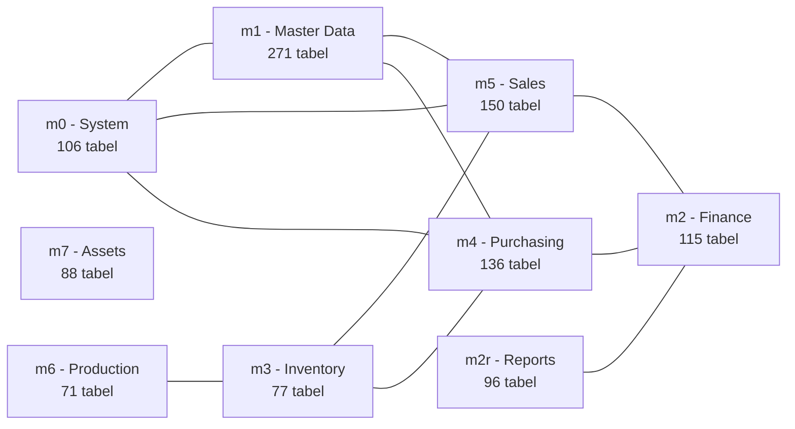
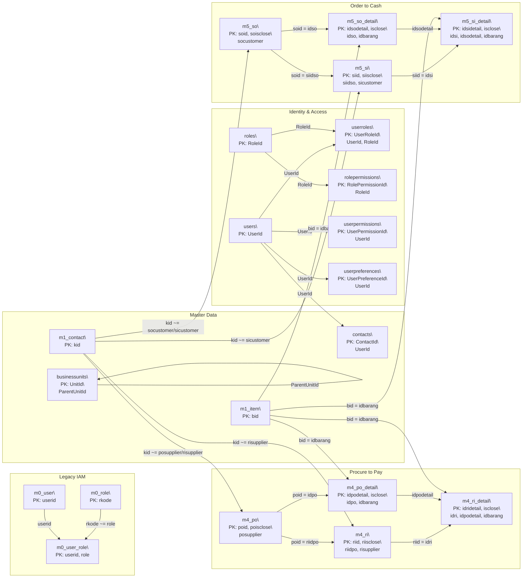

# PT MyERPPlus - Initial ERD (Heuristic)

Generated: 2026-02-20  
Source schema: `myerpplus`

Catatan:
- Schema ini tidak memiliki foreign key fisik (`06_foreign_keys.tsv` kosong).
- Relasi di diagram adalah **heuristic mapping** berdasarkan pola nama kolom (`idpo`, `idso`, `idbarang`, dll).
- Confidence relasi: `[H]=High`, `[M]=Medium`, `[L]=Low`.

## Domain map

## Initial ERD

## Referensi data sumber
- `output/02_table_catalog.tsv`
- `output/03_primary_keys.tsv`
- `output/06_foreign_keys.tsv`
- `output/relationship-confidence.csv`

## ERD per domain
- `output/domains/iam.mmd`
- `output/domains/master-data.mmd`
- `output/domains/procure-to-pay.mmd`
- `output/domains/order-to-cash.mmd`
