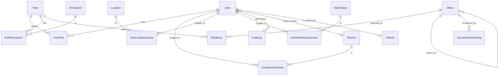
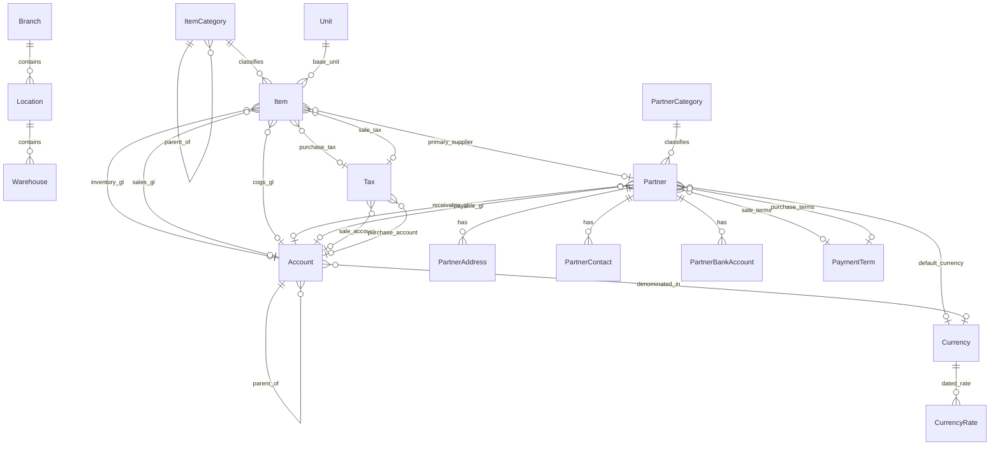
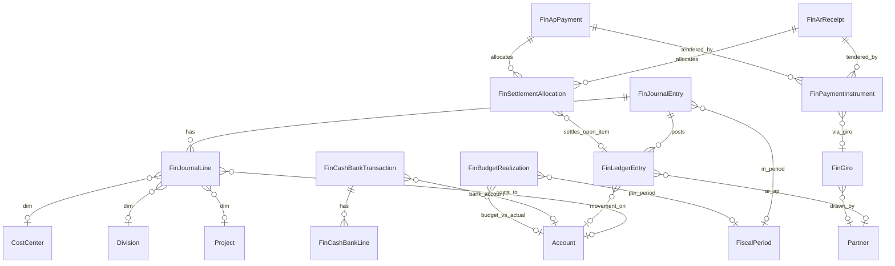
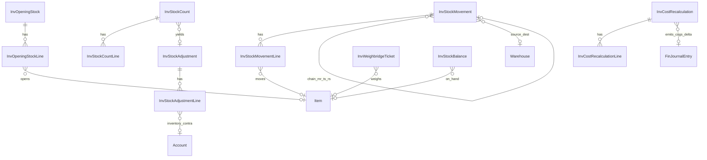
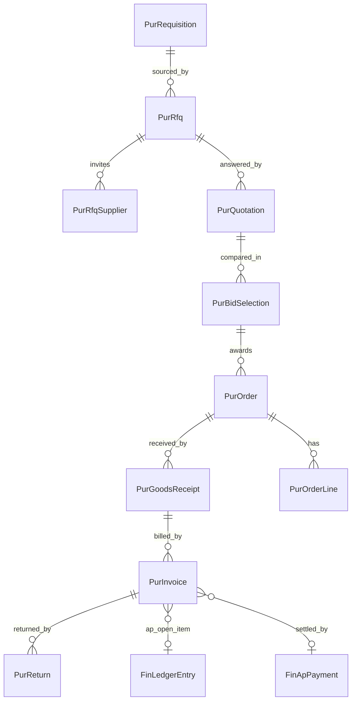
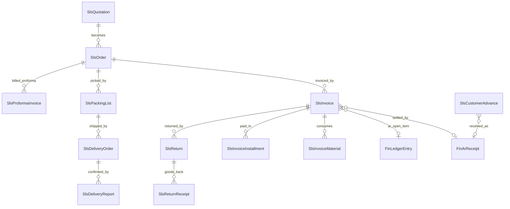
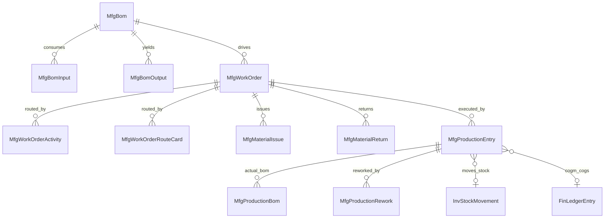
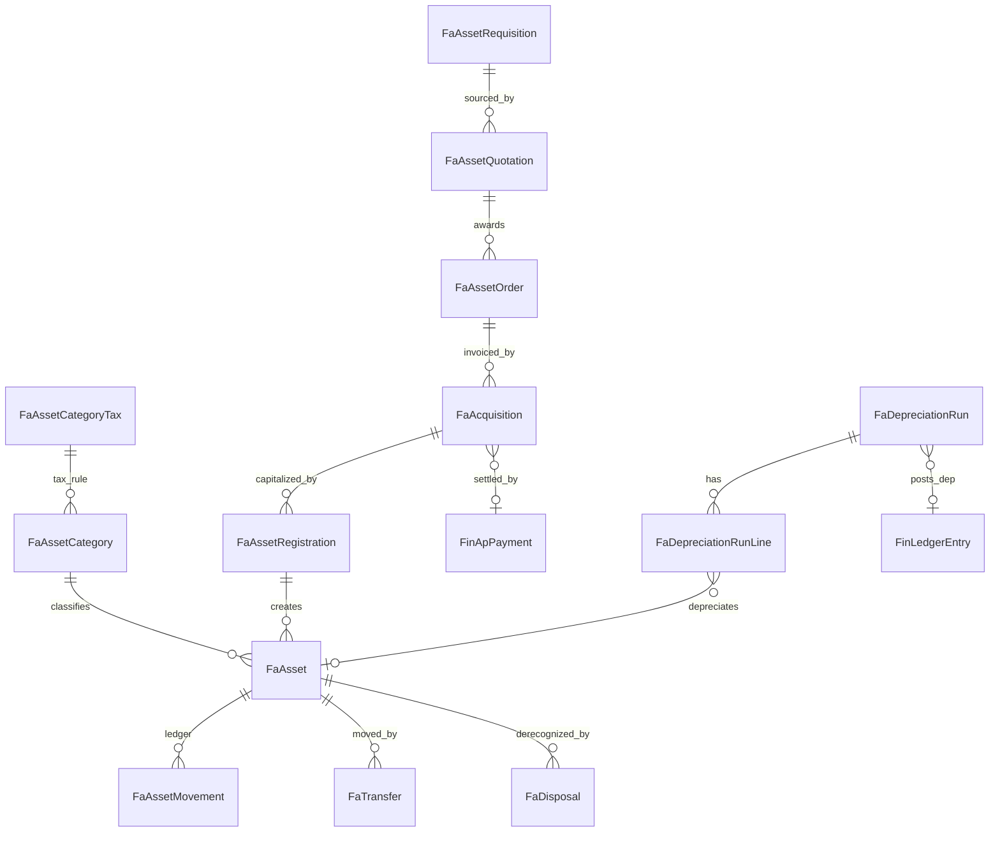
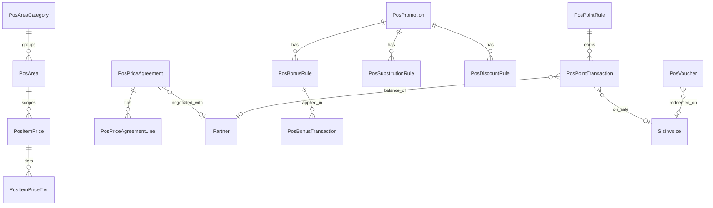

# Web-ERP — Database Design (MVP: m0 Administrator + m1 Master Data)

> Status: **DECISIONS RESOLVED** — m0+m1 MVP final; §8 #1–20 closed with the user
> on 2026-05-17. **One re-opened item** (§8.1 #21: period-close process) must be
> resolved before the m2 `fin` Prisma write. Still design-only: no `schema.prisma`
> edits / migration until the explicit "write Prisma" go-ahead (per CLAUDE.md §6).
> Date: 2026-05-17 · Author: agent (Claude) · Product: Senti ERP, `apps/web-erp`.
>
> **Single source of truth.** This `db-design/` set (this README + `entities-m0-administrator.md`
> + `entities-m1-master-data.md` + `entities-m2-finance.md` + `entities-m3-inventory.md` +
> `entities-m4-purchasing.md` + `entities-m5-sales.md` + `entities-m6-manufacturing.md`
> + `entities-m7-fixed-assets.md` + `entities-m12-pos.md` + `legacy-mapping.md` +
> `module-roadmap.md`) is the **authoritative** DB design for web-erp. `module-roadmap.md`
> maps the post-MVP modules (legacy m2–m12 → `fin`/`inv`/`pur`/`sls`/`mfg`/`fa`/`bi`/`pos`)
> at roadmap depth; per-module field catalogs follow one at a time after review
> (**m2 `fin` + m3 `inv` + m4 `pur` + m5 `sls` + m6 `mfg` + m7 `fa` + m12 `pos`
> now catalogued**; m8 `bi` remaining). The former top-level `apps/web-erp/DB-DESIGN.md` (rev. 3) has been **retired**
> to remove redundancy; the decisions it took that *differed* from this set were
> escalated and are now **resolved** in [§8 — Resolved decisions](#8-resolved-decisions-2026-05-17).

This is the data-model design for the **first MVP slice** of the new Web-ERP product.
It is derived from the legacy MyERP+ reference in `apps/web-erp/preferensi/`, but the
new product is **fresh** — legacy is used only as a behavioral/feature reference.

---

## 1. Decisions locked with the user

| Topic | Decision |
| --- | --- |
| Goal | Fresh modern product; `preferensi/` = reference only (features + business logic + flow). |
| Frontend target | Continue `apps/web-erp/prototype/` (React SPA) as the future UI. |
| MVP modules | **m0 Administrator** + **m1 Master Data** — *core subset only* (**31 tables**, not the ~70 legacy). |
| Schema style | **Modern English, normalized.** No legacy column cruft; split addresses; explicit role/permission. |
| DB placement | **Extend `apps/api-gateway/prisma/schema.prisma`** (shared Postgres with the Althea clinic domain). |
| Surrogate PK | **`BigInt @default(autoincrement())`** — ERP transaction scale (resolved §8, diverges from api-gateway `Int`). |
| Identity | **Separate `ErpUser` / `adm_users`** — ERP auth decoupled from the Althea clinic `User` (resolved §8). |
| This phase output | **ERD + design document only.** No `schema.prisma` edits, no migration until the explicit go-ahead. |

---

## 2. Source of truth & method

- Authoritative legacy model: **`apps/myerpplus-db-mapping/db/semantic-schema.json`** (419 KB) —
  every `m0_*`/`m1_*` table with English aliases, field descriptions, PKs, soft-delete filters.
- Cross-checked against: the Flex UI (`preferensi/Frontned - myerpplus/erp_mod0|erp_mod1`),
  the Node api-bridge config (`.../myerpplus-api-bridge-main/api-config/`), and backend
  data-access VB (`.../Backened - myerpplus/app_code/ws/m0|m1`).
- Raw seed available (gitignored, read-only): `/home/rania/apps/myerpplus_serenity.sql` (27 MB).

Legacy is heavily denormalized, uses cryptic Indonesian column prefixes (`bkode`, `knama`,
`cnomor`), encodes status as `*aktif` flags and magic ints, and does not enforce FKs.
The modern design corrects all of these (see conventions).

---

## 3. Global conventions (apply to every entity)

| Concern | Convention | Replaces legacy |
| --- | --- | --- |
| Surrogate PK | `id BigInt @id @default(autoincrement())` — ERP scale (resolved §8; diverges from api-gateway `Int`) | string business codes as PK |
| Business key | `code String` — unique (per-tenant where relevant) | `bkode`, `kkode`, `cnomor`, … |
| Legacy lineage | `legacyCode String?` — nullable, `@@index`; original MyERP+ code on every master, for CDC/ETL backfill (resolved §8) | implicit; no migration trail |
| Display | `name String` | `bnama`, `knama`, … |
| Soft delete | `deletedAt DateTime?` — NULL = live; all queries filter `deletedAt: null` | `*aktif = 0` |
| Business toggle | `isActive Boolean @default(true)` — only where "disabled but not deleted" is meaningful | overloaded `*aktif` |
| Audit | `createdAt`, `updatedAt`, `createdById Int?`, `updatedById Int?` (→ User) | `*inputuser/tgl`, `*modifikasiuser/tgl` |
| Money | `Decimal @db.Decimal(19,4)` | untyped numeric |
| Quantity | `Decimal @db.Decimal(19,4)` | untyped numeric |
| Rate / percent | `Decimal @db.Decimal(9,4)` | untyped numeric |
| Timestamps | Stored UTC (`timestamptz`); business TZ Asia/Jakarta resolved in app layer | naive local datetime (ADR 008 hazard) |
| Extensibility | `metadata Json?` for rare/optional attributes | `bcustom1..15`, `kcustomtext1..5` |
| Denormalized names | **Not stored.** Resolve via relations/API (e.g. category name via join) | `*nama` echo columns |
| FK integrity | Enforced at DB level (Prisma relations + `onDelete` rules) | not enforced in MyERP+ |
| Enums | Postgres enums for type/status | magic ints (`ulevel` 0–4, COA `A/H/M/P/B`) |

**Tenancy (MVP):** `Branch` is the org/legal unit. Masters are global unless a business
reason scopes them; per-user data visibility is via `UserBranchAccess` /
`UserWarehouseAccess` / `UserLocationAccess`. Multi-dimension tagging of GL
(branch/location/division on every account) is **deferred** — see §8.

---

## 4. Enum catalog

| Enum | Values | Source |
| --- | --- | --- |
| `UserLevel` | `POS`, `CENTRAL`, `POS_AND_CENTRAL`, `BI`, `BI_AND_CENTRAL` | `m0_user.ulevel` 0–4 |
| `MenuType` | `MODULE`, `GROUP`, `ITEM` | `m0_menu.mntype` |
| `FiscalPeriodStatus` | `OPEN`, `SOFT_CLOSED`, `CLOSED`, `REOPENED` | `m0_setting` fiscal flags (tiers added — resolved §8 #20) |
| `NumberingReset` | `NEVER`, `YEARLY`, `MONTHLY` | `m0_nomor` behavior |
| `ItemType` | `INVENTORY`, `SERVICE`, `VOUCHER`, `ASSEMBLY` | `m1_item_type` / `bjenis` |
| `AccountType` | `ASSET`, `LIABILITY`, `EQUITY`, `REVENUE`, `EXPENSE` | `m1_coa.ctipe` |
| `AccountKind` | `HEADER`, `POSTABLE` | `m1_coa.cjenis` (A/H/M/P/B) |
| `NormalBalance` | `DEBIT`, `CREDIT` | `m1_coa.cdc` |
| `CashFlowCategory` | `OPERATING`, `INVESTING`, `FINANCING` | `m1_coa.caruskas` (O/I/P) |
| `AddressType` | `BILLING`, `SHIPPING`, `OFFICE`, `OTHER` | `m1_contact` k1..k4 blocks |
| `PartnerCategoryKind` | `CUSTOMER`, `SUPPLIER`, `SALESMAN`, `GENERAL` | merged contact category tables |
| `AuditAction` | `CREATE`, `UPDATE`, `DELETE`, `RESTORE`, `LOGIN`, `LOGOUT` | new — `sys_audit_logs` (legacy `m0_userlog`) |
| `JournalType` | `GENERAL`, `MEMORIAL`, `ADJUSTMENT`, `OPENING_BALANCE` | m2 `m2_gj`/`jm`/`aj`/`cb` |
| `DocumentStatus` | `DRAFT`, `POSTED`, `VOID`, `CANCELLED` | m2 `*status` |
| `PostingStatus` | `UNPOSTED`, `POSTED` | m2 `*posting` |
| `SettlementStatus` | `UNPAID`, `PARTIAL`, `PAID` | m2 `*statusbayar` |
| `CashBankDirection` | `RECEIPT`, `DISBURSEMENT` | m2 `m2_cr` vs `m2_bd` |
| `PaymentMethod` | `CASH`, `TRANSFER`, `GIRO`, `CHEQUE`, `CARD`, `OTHER` | m2 `*carabayar` |
| `GiroType` | `INCOMING`, `OUTGOING` | m2 `m2_rg` vs `m2_sg` |
| `GiroStatus` | `OUTSTANDING`, `CLEARED`, `BOUNCED`, `CANCELLED` | m2 `glstatus`/`rgc`/`sgc` |
| `ArApType` | `RECEIVABLE`, `PAYABLE` | m2 `thutangpiutang` |
| `ReconciliationStatus` | `UNRECONCILED`, `RECONCILED` | m2 `tsudahrekonsiliasi` |

| `StockMovementType` | `REQUEST`, `ISSUE`, `TRANSFER`, `TRANSFER_RECEIPT`, `RETURN` | m3 `m3_mr`/`rf`/`ts`/`rs` |
| `StockCountType` | `FULL`, `CYCLE`, `SPOT` | m3 `m3_sp` |
| `AdjustmentDirection` | `INCREASE`, `DECREASE` | m3 `m3_sa` |
| `CostingMethod` | `AVG`, `FIFO`, `STD` | new — inventory valuation (resolved §8 #19); global setting, default `AVG` |
| `CostRecalcStatus` | `PENDING`, `COMPLETED`, `FAILED` | new — `inv_cost_recalculations` run state (resolved §8 #18) |
| `PurchaseDocType` | `REQUISITION`, `RFQ`, `QUOTATION`, `BID_SELECTION`, `ORDER`, `GOODS_RECEIPT`, `INVOICE`, `RETURN` | m4 chain |
| `PurchaseReturnType` | `DEBIT_NOTE`, `RETURN_TO_VENDOR` | m4 `m4_dnr` vs `m4_prt` |
| `PriceMode` | `TAX_INCLUSIVE`, `TAX_EXCLUSIVE` | m4 `*hargatermasukpajak` |
| `SalesDocType` | `QUOTATION`, `ORDER`, `PROFORMA_INVOICE`, `PACKING_LIST`, `DELIVERY_ORDER`, `DELIVERY_REPORT`, `INVOICE`, `RETURN`, `RETURN_RECEIPT` | m5 chain |
| `MfgDocType` | `BOM`, `WORK_ORDER`, `MATERIAL_ISSUE`, `MATERIAL_RETURN`, `PRODUCTION`, `REWORK` | m6 doc set |
| `DepreciationMethod` | `STRAIGHT_LINE`, `DECLINING_BALANCE`, `DOUBLE_DECLINING`, `SUM_OF_YEARS`, `UNITS_OF_PRODUCTION`, `NONE` | m7 `ametode` |
| `FaDocType` | `REQUISITION`, `QUOTATION`, `ORDER`, `ACQUISITION`, `REGISTRATION`, `DEPRECIATION`, `TRANSFER`, `DISPOSAL` | m7 doc set |
| `AssetMovementType` | `ACQUISITION`, `DEPRECIATION`, `REVALUATION`, `TRANSFER`, `DISPOSAL`, `ADJUSTMENT` | m7 `atjenismutasi` |
| `PromotionType` | `BONUS`, `SUBSTITUTION`, `ADDITIONAL_ITEM`, `DISCOUNT`, `VOUCHER` | m12 promo family |
| `DiscountScope` | `ITEM`, `ITEM_CATEGORY`, `CUSTOMER_CATEGORY` | m12 discount/point matrices |
| `PointTransactionType` | `EARN`, `REDEEM`, `ADJUST` | m12 `pos_point_transaction` |
| `VoucherStatus` | `ISSUED`, `REDEEMED`, `EXPIRED`, `VOID` | m12 `pos_voucher` |
| `SalesChannel` *(flagged onto `sls_invoices`)* | `STANDARD`, `POS` | m12 `m12_si` vs m5 |

> Enum detail per module: **[m2 fin](entities-m2-finance.md)** /
> **[m3 inv](entities-m3-inventory.md)** / **[m4 pur](entities-m4-purchasing.md)** /
> **[m5 sls](entities-m5-sales.md)** / **[m6 mfg](entities-m6-manufacturing.md)** /
> **[m7 fa](entities-m7-fixed-assets.md)** / **[m12 pos](entities-m12-pos.md)**.
> `CashFlowCategory` reused for `tjenisaruskas`; `DocumentStatus`/`PostingStatus`
> reused across `fin`/`inv`/`pur`/`sls`/`mfg`/`fa`/`pos`; `PriceMode` across
> `pur`/`sls`/`fa`; `DiscountScope` across `pos` discount + point rules.

---

## 5. ERD — m0 Identity & Access

System-config entities (no hard relations): `Setting`, `FiscalPeriod`.
`AuditLog` (`sys_audit_logs`) records who-changed-what across all entities — in MVP (resolved §8).
Full field-level catalog: **[entities-m0-administrator.md](entities-m0-administrator.md)**.

## 6. ERD — m1 Master Data

Full field-level catalog: **[entities-m1-master-data.md](entities-m1-master-data.md)**.

## 6.1 ERD — m2 Finance / GL (`fin`)

Accounting period reuses `sys_fiscal_periods`; GL dimension masters
(`md_cost_centers`/`md_divisions`/`md_subdivisions`/`md_projects`) live in `md`.
Full field-level catalog: **[entities-m2-finance.md](entities-m2-finance.md)**.

## 6.2 ERD — m3 Inventory (`inv`)

`InvStockBalance` is a **derived view** (opening + posted movements + adjustments),
not a written table. `InvCostRecalculation` is the perpetual **recost run** that
emits an auto `ADJUSTMENT` journal for the COGS delta (resolved §8 #18) — ledger
stays immutable. Period reuses `sys_fiscal_periods` (lifecycle now
`OPEN`/`SOFT_CLOSED`/`CLOSED`/`REOPENED`, §8 #20); dimensions reuse the m2
`md_*` masters. `m3_dc`/`m3_pa` flagged out. Full catalog:
**[entities-m3-inventory.md](entities-m3-inventory.md)**.

## 6.3 ERD — m4 Purchasing (`pur`)

Each chain doc shares «PurchaseDocHeader»/«PurchaseDocLine» + line tables.
**Payment/settlement reuses `fin_ap_payments`/`fin_payment_instruments`/
`fin_settlement_allocations`** (no `pur_payment*` tables; +4 optional FX/term
columns flagged onto `fin_ap_payments`). `m4_ipc`/`m4_pie` folded/secondary.
Full catalog: **[entities-m4-purchasing.md](entities-m4-purchasing.md)**.

## 6.4 ERD — m5 Sales / AR (`sls`)

Mirror of m4: «SalesDocHeader»/«SalesDocLine» reuse the purchase shapes
(customer-side). **Payment/settlement reuses `fin_ar_receipts`/
`fin_payment_instruments`/`fin_settlement_allocations`** (no `sls_payment*`
tables; same +4 FX/term cols flagged onto `fin_ar_receipts`). `m5_cl`/`m5_spa`
(loyalty→`pos`)/`m5_rp` flagged out. Full catalog:
**[entities-m5-sales.md](entities-m5-sales.md)**.

## 6.5 ERD — m6 Manufacturing (`mfg`)

Every doc has input (consumed) + output (produced) line sets sharing
«MfgDocHeader»/«MfgInputLine»/«MfgOutputLine». Source = SQL dump (m6 not in
semantic-schema). Posting flows to `inv` (stock) + `fin` (COGM/COGS). Machine
master deferred. Full catalog:
**[entities-m6-manufacturing.md](entities-m6-manufacturing.md)**.

## 6.6 ERD — m7 Fixed Assets (`fa`)

Acquisition chain reuses «PurchaseDocHeader» + «AssetLine»; AT payment reuses
`fin_ap_payments`. `fa_asset_movements` is an append-only per-asset ledger.
Asset-ops long tail flagged/deferred. Source = SQL dump. Full catalog:
**[entities-m7-fixed-assets.md](entities-m7-fixed-assets.md)**.

## 6.7 ERD — m12 POS / Retail & Promotions (`pos`)

Realizes the deferred **tiered pricing** (§8 #3) as `pos_item_prices`(+tiers)/
`pos_price_agreements`. POS sale **reuses `sls_invoices`** (`channel = POS`;
+4 cols flagged). Config reuses `sys_settings`; stock transfer reuses `inv`.
⚠ Source = VB ws + Flex (m12 not in semantic-schema/SQL) — **inferred fields,
verify before Prisma**. Full catalog:
**[entities-m12-pos.md](entities-m12-pos.md)**.

---

## 7. Integration into `apps/api-gateway` (shared DB)

The user chose to extend the existing api-gateway Prisma schema. That schema **already
defines `User` (`@@map("m0_users")`) and `Menu` (`@@map("m0_menu")`) repurposed for the
Althea clinic.** A clean ERP cannot reuse those without coupling clinic + ERP concerns.

**Recommended strategy — namespaced ERP models:**

- Prisma model names prefixed `Erp*` (e.g. `ErpUser`, `ErpRole`, `ErpMenu`, `ErpItem`,
  `ErpPartner`, `ErpAccount`) to avoid Prisma model-name collisions.
- Physical tables in **semantic-domain namespaces** via `@@map` — `sys_*` (system
  config: `sys_menus`, `sys_settings`, `sys_document_numberings`, `sys_fiscal_periods`),
  `adm_*` (identity & access: `adm_users`, `adm_roles`, `adm_user_roles`, …),
  `md_*` (master data: `md_items`, `md_partners`, `md_accounts`, …). **No `erp_`
  prefix, no numeric `m<n>` segment.** Coexists with platform `m0_*`, `m1_*`,
  `clinic_*` — domain namespaces don't intersect platform prefixes. See
  [web-erp/CLAUDE.md §1](../CLAUDE.md).
- ERP migrations live in the same `prisma/migrations/` history; name them `erp-*`
  (e.g. `erp-core-sys-adm-md`) so the boundary is auditable. (Per CLAUDE.md §6, a
  real migration must be run *after* approval — not in this phase.)

This keeps one Postgres instance/connection while isolating the ERP domain. The alternative
(reuse the existing `User`/`Menu`) is documented as an open decision in §8.

---

## 8. Resolved decisions (2026-05-17)

Authoritative decision log; the rest of this set reflects it. #1–17 resolved in two
`AskUserQuestion` rounds (2026-05-17); #18–21 added the same day from the m2 `fin`
design test (HPP recalculation / periodic journal / non-disruptive input). One item
re-opened — see **§8.1**.

| # | Decision | Outcome | Effect on design |
| --- | --- | --- | --- |
| 1 | ERP `User` vs clinic `User` | **Separate `ErpUser` / `adm_users`** | Confirms current design; ERP auth decoupled from Althea (CLAUDE.md §1). |
| 2 | Surrogate PK type | **`BigInt @default(autoincrement())`** | **Changed** from `Int`. Every ERP PK/FK is `BigInt` — diverges from api-gateway `Int`; cross-table joins to platform tables must cast. |
| 3 | Audit log / change history | **In MVP** — `sys_audit_logs` (`ErpAuditLog`) | **Added.** New entity + `AuditAction` enum; +1 table. Removed from §9 deferred. |
| 4 | Per-user data scoping | **In MVP** | Confirms current design — `UserBranch/Location/WarehouseAccess` kept. |
| 5 | Partner customer/supplier duality | **Boolean flags** | Confirms current design — `isCustomer`/`isSupplier`/`isSalesman`. |
| 6 | FiscalPeriod scope | **Global** — unique `(year, periodNo)` | Confirms current design; no branch dimension. |
| 7 | `legacyCode` per master | **Add** — nullable, indexed | **Changed.** Added to global conventions (§3) + every `md_*` master + `sys_*`/`adm_*` masters; for CDC/ETL backfill. |
| 8 | Currency rates | **Dated `CurrencyRate` table now** | **Changed.** `Currency.exchangeRate` snapshot removed; new `CurrencyRate(currencyId, rateDate, rate)` (1:N). +1 table. |
| 9 | GL multi-dimension (branch/location/division on COA) | ~~Deferred~~ → **SUPERSEDED by #14** | Originally deferred for the m0+m1 MVP; the m2 `fin` decision (#16) brings full GL dimensions in. |
| 10 | Tiered pricing (10 price/discount tiers, `m1_contact_price`) | **Deferred** | Single `salePrice`/`purchasePrice`; later `ItemPrice`/`PartnerPrice` phase. |
| 11 | ItemType | **Enum** (not master table) | Confirms current design; switch to table only if user-defined types needed. |
| 12 | Partner bank | **Separate `md_partner_bank_accounts` (1:N)** | Confirms current design. |
| 13 | ItemCategory nesting | **Nested** (optional self-ref `parentId`) | Confirms current design. |
| 14 | Post-MVP module scope | **Roadmap all modules first** (coarse), deep catalog per module after review | New `module-roadmap.md` maps legacy m2–m12 → semantic domains. |
| 15 | Per-module design depth | **Modern core subset** (not legacy 1:1) | Unify legacy doc variants; `riwayat_*` → `sys_audit_logs`; normalized line tables. |
| 16 | GL multi-dimension (revisits #9) | **IN** — full analytic dimensions on journal lines | Adds `md_cost_centers`/`md_divisions`/`md_subdivisions`/`md_projects` to `md` (org-hierarchy masters un-deferred). |
| 17 | Domain naming for new modules | `fin`,`inv`,`pur`,`sls`,`mfg`,`fa`,`bi`,`pos` | Semantic per-function (CLAUDE.md §1); legacy m11 clinic vertical **excluded** (Althea); m9 none; m10 needs study. |
| 18 | Inventory accounting & HPP recalculation | **Perpetual + recost adjustment** | COGS booked per transaction; backdated/cost-affecting posts trigger a **recost run** (`inv_cost_recalculations`) that emits an auto `JournalType.ADJUSTMENT` for the COGS delta. `fin_ledger_entries` stays immutable — no edits to posted rows. Line `unitCost` = frozen as-posted snapshot; recomputed cost lives in the recost record + `inv_stock_balances`. +1 `inv_*` table + `CostRecalcStatus` enum. |
| 19 | Costing method made explicit | **Global setting, default `AVG`** | New `CostingMethod` enum (`AVG`/`FIFO`/`STD`); held as `sys_settings` key `inventory.costing_method` (default `AVG` = moving-average). Not per-item. Recost logic must be method-aware. |
| 20 | Period lifecycle for non-disruptive input | **Add `SOFT_CLOSED` + `REOPENED`** | `FiscalPeriodStatus` → `OPEN`→`SOFT_CLOSED`→`CLOSED`→`REOPENED`. `FiscalPeriod` gains reopen-audit fields. Operational docs keep posting while accountant finalizes; matrix `JournalType × FiscalPeriodStatus` defined in `entities-m2-finance.md`. Invariant added: `fiscalPeriodId` ≡ period containing `entryDate`. |
| 21 | Period-close process entity & `JournalType.CLOSING` | **Deferred (OPEN)** | NOT modeled now. `fin_period_closings` + closing journal type left **open** — see §8.1. MVP+m2 scope focuses on recost HPP (#18) + soft-lock (#20); period-end batch closing handled later. |

**Changed vs prior draft:** #2 (BigInt), #3 (audit log added), #7 (legacyCode added),
#8 (CurrencyRate table), #18–20 (recost HPP + costing method + period tiers).
Items #1, #4–6, #9–13 ratify the existing `db-design/` model.
The retired `DB-DESIGN.md` rev. 3 divergences are now fully reconciled.

### 8.1 Open decision (re-opened 2026-05-17)

| # | Question | Status | Notes |
| --- | --- | --- | --- |
| 21 | Period-close process: dedicated `fin_period_closings` run entity + `JournalType.CLOSING`/`PERIOD_END` (generated closing journal, retained-earnings roll, reopenable)? | **OPEN — deferred** | Resolve before the m2 `fin` Prisma write. Until then: period close = setting `status = CLOSED` + manual closing JV (`JournalType.MEMORIAL`/`ADJUSTMENT`); no automated tutup-buku run. Recost (#18) and soft-lock (#20) do **not** depend on this. |

## 9. Deferred (intentionally NOT in this MVP)

Out of the **m0+m1 MVP slice** specifically (but most are now roadmapped — see below):
product attributes (brand/color/size/model/material), geography masters
(country/province/city), department/section sub-hierarchy, expedition,
price categories, transaction-note templates, approval workflow,
file/attachment manager, import/export tooling.
(Audit-log / change history is **now in MVP** — `sys_audit_logs`, resolved §8 #3.)

**No longer "just deferred" — now roadmapped** (resolved §8 #14): the legacy
transactional modules m2–m12 (Finance, Inventory, Purchasing, Sales, Manufacturing,
Fixed Assets, BI, POS) are mapped at roadmap depth in
**[module-roadmap.md](module-roadmap.md)**. GL dimension masters
(`md_cost_centers`/`md_divisions`/`md_subdivisions`/`md_projects`) are **un-deferred**
(resolved §8 #16). Per-module field catalogs are produced sequentially after review.
Legacy lineage for m1's unmapped masters: **[legacy-mapping.md](legacy-mapping.md)**.
