# Web-ERP — Database Design (MVP: m0 Administrator + m1 Master Data)

> Status: **PRISMA WRITTEN + MIGRATED (2026-05-18)** — all decisions resolved;
> §8 #1–42 + §8.1 closed with the user. On user go-ahead ("buatkan tabel, prisma,
> seed dari db-design semuanya") the full post-MVP catalog was translated into
> `apps/api-gateway/prisma/schema.prisma` and applied as migration
> `20260518_003_erp_modules_fin_inv_pur_sls_mfg_fa_pos_pln` (purely additive: 156
> ERP tables across `fin`/`inv`/`pur`/`sls`/`mfg`/`fa`/`pos`/`pln` + `md` GL-dim
> masters, 53 new enums; 0 DROP, clinic/`m0_*`/`m1_*` untouched). **Design note —
> cross-domain references are stored as scalar `BigInt` FK + `@@index` WITHOUT a
> Prisma `@relation` / DB-level FK**, to keep domains decoupled and the generator
> independent; intra-domain FKs are enforced. This consciously relaxes §3
> "FK integrity enforced at DB level" for *cross-domain* links only — revisit if
> referential integrity across domains becomes required. `inv_stock_balances` is a
> derived view (not a table). `bi`/m8 **excluded** — no field catalog exists yet.
> Date: 2026-05-18 · Author: agent (Claude) · Product: Senti ERP, `apps/web-erp`.
>
> **Single source of truth.** This `db-design/` set (this README + `entities-m0-administrator.md`
> + `entities-m1-master-data.md` + `entities-m2-finance.md` + `entities-m3-inventory.md` +
> `entities-m4-purchasing.md` + `entities-m5-sales.md` + `entities-m6-manufacturing.md`
> + `entities-m7-fixed-assets.md` + `entities-m12-pos.md` + `entities-pln-planning.md` + `legacy-mapping.md` +
> `module-roadmap.md`) is the **authoritative** DB design for web-erp. `module-roadmap.md`
> maps the post-MVP modules (legacy m2–m12 → `fin`/`inv`/`pur`/`sls`/`mfg`/`fa`/`bi`/`pos`)
> at roadmap depth; per-module field catalogs follow one at a time after review
> (**m2 `fin` + m3 `inv` + m4 `pur` + m5 `sls` + m6 `mfg` + m7 `fa` + m12 `pos`
> now catalogued**; m8 `bi` remaining). The former top-level `apps/web-erp/DB-DESIGN.md` (rev. 3) has been **retired**
> to remove redundancy; the decisions it took that *differed* from this set were
> escalated and are now **resolved** in [§8 — Resolved decisions](#8-resolved-decisions-2026-05-17).

This is the data-model design for the **first MVP slice** of the new Web-ERP product.
It is derived from the legacy MyERP+ reference in `apps/web-erp/preferensi/`, but the
new product is **fresh** — legacy is used only as a behavioral/feature reference.

---

## 1. Decisions locked with the user

| Topic | Decision |
| --- | --- |
| Goal | Fresh modern product; `preferensi/` = reference only (features + business logic + flow). |
| Frontend target | Continue `apps/web-erp/prototype/` (React SPA) as the future UI. |
| MVP modules | **m0 Administrator** + **m1 Master Data** — *core subset only* (**37 tables**: 20 `adm_*`/`sys_*` + 17 `md_*`; not the ~70 legacy). |
| Schema style | **Modern English, normalized.** No legacy column cruft; split addresses; explicit role/permission. |
| DB placement | **Extend `apps/api-gateway/prisma/schema.prisma`** (shared Postgres with the Althea clinic domain). |
| Surrogate PK | **`BigInt @default(autoincrement())`** — ERP transaction scale (resolved §8, diverges from api-gateway `Int`). |
| Identity | **Separate `ErpUser` / `adm_users`** — ERP auth decoupled from the Althea clinic `User` (resolved §8). |
| This phase output | **ERD + design document only.** No `schema.prisma` edits, no migration until the explicit go-ahead. |

---

## 2. Source of truth & method

- Authoritative legacy model: **`apps/myerpplus-db-mapping/db/semantic-schema.json`** (419 KB) —
  every `m0_*`/`m1_*` table with English aliases, field descriptions, PKs, soft-delete filters.
- Cross-checked against: the Flex UI (`preferensi/Frontned - myerpplus/erp_mod0|erp_mod1`),
  the Node api-bridge config (`.../myerpplus-api-bridge-main/api-config/`), and backend
  data-access VB (`.../Backened - myerpplus/app_code/ws/m0|m1`).
- Raw seed available (gitignored, read-only): `/home/rania/apps/myerpplus_serenity.sql` (27 MB).

Legacy is heavily denormalized, uses cryptic Indonesian column prefixes (`bkode`, `knama`,
`cnomor`), encodes status as `*aktif` flags and magic ints, and does not enforce FKs.
The modern design corrects all of these (see conventions).

---

## 3. Global conventions (apply to every entity)

| Concern | Convention | Replaces legacy |
| --- | --- | --- |
| Surrogate PK | `id BigInt @id @default(autoincrement())` — ERP scale (resolved §8; diverges from api-gateway `Int`) | string business codes as PK |
| Business key | `code String` — unique (per-tenant where relevant) | `bkode`, `kkode`, `cnomor`, … |
| Legacy lineage | `legacyCode String?` — nullable, `@@index`; original MyERP+ code on every master, for CDC/ETL backfill (resolved §8) | implicit; no migration trail |
| Display | `name String` | `bnama`, `knama`, … |
| Soft delete | `deletedAt DateTime?` — NULL = live; all queries filter `deletedAt: null` | `*aktif = 0` |
| Business toggle | `isActive Boolean @default(true)` — only where "disabled but not deleted" is meaningful | overloaded `*aktif` |
| Audit | `createdAt`, `updatedAt`, `createdById Int?`, `updatedById Int?` (→ User) | `*inputuser/tgl`, `*modifikasiuser/tgl` |
| Money | `Decimal @db.Decimal(19,4)` | untyped numeric |
| Quantity | `Decimal @db.Decimal(19,4)` | untyped numeric |
| Rate / percent | `Decimal @db.Decimal(9,4)` | untyped numeric |
| Timestamps | Stored UTC (`timestamptz`); business TZ Asia/Jakarta resolved in app layer | naive local datetime (ADR 008 hazard) |
| Extensibility | `metadata Json?` for rare/optional attributes | `bcustom1..15`, `kcustomtext1..5` |
| Denormalized names | **Not stored.** Resolve via relations/API (e.g. category name via join) | `*nama` echo columns |
| FK integrity | Enforced at DB level (Prisma relations + `onDelete` rules) | not enforced in MyERP+ |
| Enums | Postgres enums for type/status | magic ints (`ulevel` 0–4, COA `A/H/M/P/B`) |

**Tenancy (MVP):** `Branch` is the org/legal unit. Masters are global unless a business
reason scopes them; per-user data visibility is via `UserBranchAccess` /
`UserWarehouseAccess` / `UserLocationAccess`. Multi-dimension tagging of GL
(branch/location/division on every account) is **deferred** — see §8.

---

## 4. Enum catalog

| Enum | Values | Source |
| --- | --- | --- |
| `UserLevel` | `POS`, `CENTRAL`, `POS_AND_CENTRAL`, `BI`, `BI_AND_CENTRAL` | `m0_user.ulevel` 0–4 |
| `MenuType` | `MODULE`, `GROUP`, `ITEM` | `m0_menu.mntype` |
| `FiscalPeriodStatus` | `OPEN`, `SOFT_CLOSED`, `CLOSED`, `REOPENED` | `m0_setting` fiscal flags (tiers added — resolved §8 #20) |
| `NumberingReset` | `NEVER`, `YEARLY`, `MONTHLY` | `m0_nomor` behavior |
| `ItemType` | `INVENTORY`, `SERVICE`, `VOUCHER`, `ASSEMBLY` | `m1_item_type` / `bjenis` |
| `AccountType` | `ASSET`, `LIABILITY`, `EQUITY`, `REVENUE`, `EXPENSE` | `m1_coa.ctipe` |
| `AccountKind` | `HEADER`, `POSTABLE` | `m1_coa.cjenis` (A/H/M/P/B) |
| `NormalBalance` | `DEBIT`, `CREDIT` | `m1_coa.cdc` |
| `CashFlowCategory` | `OPERATING`, `INVESTING`, `FINANCING` | `m1_coa.caruskas` (O/I/P) |
| `AddressType` | `BILLING`, `SHIPPING`, `OFFICE`, `OTHER` | `m1_contact` k1..k4 blocks |
| `PartnerCategoryKind` | `CUSTOMER`, `SUPPLIER`, `SALESMAN`, `GENERAL` | merged contact category tables |
| `AuditAction` | `CREATE`, `UPDATE`, `DELETE`, `RESTORE`, `LOGIN`, `LOGOUT` | new — `sys_audit_logs` (legacy `m0_userlog`) |
| `NotificationChannel` | `EMAIL`, `WHATSAPP`, `IN_APP`, `SMS` | new — `sys_email_templates` (§8 #41) |
| `JournalType` | `GENERAL`, `MEMORIAL`, `ADJUSTMENT`, `OPENING_BALANCE`, `CLOSING` | m2 `m2_gj`/`jm`/`aj`/`cb`; `CLOSING` = system-generated tutup buku (resolved §8 #21) |
| `DocumentStatus` | `DRAFT`, `POSTED`, `VOID`, `CANCELLED` | m2 `*status` |
| `PostingStatus` | `UNPOSTED`, `POSTED` | m2 `*posting` |
| `SettlementStatus` | `UNPAID`, `PARTIAL`, `PAID` | m2 `*statusbayar` |
| `CashBankDirection` | `RECEIPT`, `DISBURSEMENT` | m2 `m2_cr` vs `m2_bd` |
| `PaymentMethod` | `CASH`, `TRANSFER`, `GIRO`, `CHEQUE`, `CARD`, `OTHER` | m2 `*carabayar` |
| `GiroType` | `INCOMING`, `OUTGOING` | m2 `m2_rg` vs `m2_sg` |
| `GiroStatus` | `OUTSTANDING`, `CLEARED`, `BOUNCED`, `CANCELLED` | m2 `glstatus`/`rgc`/`sgc` |
| `ArApType` | `RECEIVABLE`, `PAYABLE` | m2 `thutangpiutang` |
| `ReconciliationStatus` | `UNRECONCILED`, `RECONCILED` | m2 `tsudahrekonsiliasi` |

| `StockMovementType` | `REQUEST`, `ISSUE`, `TRANSFER`, `TRANSFER_RECEIPT`, `RETURN` | m3 `m3_mr`/`rf`/`ts`/`rs` |
| `StockCountType` | `FULL`, `CYCLE`, `SPOT` | m3 `m3_sp` |
| `AdjustmentDirection` | `INCREASE`, `DECREASE` | m3 `m3_sa` |
| `LotStatus` | `ACTIVE`, `QUARANTINE`, `EXPIRED`, `BLOCKED` | new — m3 batch/expiry (resolved §8 #24) |
| `SerialStatus` | `IN_STOCK`, `ISSUED`, `RETURNED`, `SCRAPPED` | new — m3 serial lifecycle (resolved §8 #24) |
| `ReservationStatus` | `ACTIVE`, `FULFILLED`, `RELEASED`, `EXPIRED` | new — m3 ATP / soft allocation (resolved §8 #25) |
| `MrpRunStatus` | `DRAFT`, `PROCESSING`, `COMPLETED`, `FAILED` | new — `pln` MRP run lifecycle (resolved §8 #29) |
| `LotSizeMethod` | `LOT_FOR_LOT`, `FIXED_QTY`, `EOQ`, `MIN_MAX` | new — `pln` reorder lot sizing (resolved §8 #29) |
| `ReplenishmentSource` | `PURCHASE`, `MANUFACTURE`, `TRANSFER` | new — `pln` replenishment action type (resolved §8 #29) |
| `SuggestionStatus` | `PENDING`, `APPROVED`, `REJECTED`, `CONVERTED` | new — `pln` suggestion approval flow (resolved §8 #29) |
| `CostingMethod` | `AVG`, `FIFO`, `STD` | new — inventory valuation (resolved §8 #19); global setting, default `AVG` |
| `CostRecalcStatus` | `PENDING`, `COMPLETED`, `FAILED` | new — `inv_cost_recalculations` run state (resolved §8 #18) |
| `PeriodCloseStatus` | `PENDING`, `IN_PROGRESS`, `COMPLETED`, `FAILED` | new — `fin_period_closings` run state (resolved §8 #21) |
| `PurchaseDocType` | `REQUISITION`, `RFQ`, `QUOTATION`, `BID_SELECTION`, `ORDER`, `GOODS_RECEIPT`, `INVOICE`, `RETURN` | m4 chain |
| `PurchaseReturnType` | `DEBIT_NOTE`, `RETURN_TO_VENDOR` | m4 `m4_dnr` vs `m4_prt` |
| `PriceMode` | `TAX_INCLUSIVE`, `TAX_EXCLUSIVE` | m4 `*hargatermasukpajak` |
| `QcStatus` | `PENDING`, `PASSED`, `FAILED`, `PARTIAL` | new — `pur_goods_receipt` line QC state (resolved §8 #38) |
| `MatchStatus` | `PENDING`, `MATCHED`, `MISMATCH`, `WAIVED` | new — `pur_invoices` 3-way match (resolved §8 #37) |
| `SalesDocType` | `QUOTATION`, `ORDER`, `PROFORMA_INVOICE`, `PACKING_LIST`, `DELIVERY_ORDER`, `DELIVERY_REPORT`, `INVOICE`, `RETURN`, `RETURN_RECEIPT` | m5 chain |
| `MfgDocType` | `BOM`, `WORK_ORDER`, `MATERIAL_ISSUE`, `MATERIAL_RETURN`, `PRODUCTION`, `REWORK` | m6 doc set |
| `DepreciationMethod` | `STRAIGHT_LINE`, `DECLINING_BALANCE`, `DOUBLE_DECLINING`, `SUM_OF_YEARS`, `UNITS_OF_PRODUCTION`, `NONE` | m7 `ametode` |
| `FaDocType` | `REQUISITION`, `QUOTATION`, `ORDER`, `ACQUISITION`, `REGISTRATION`, `DEPRECIATION`, `TRANSFER`, `DISPOSAL` | m7 doc set |
| `AssetMovementType` | `ACQUISITION`, `DEPRECIATION`, `REVALUATION`, `TRANSFER`, `DISPOSAL`, `ADJUSTMENT` | m7 `atjenismutasi` |
| `PromotionType` | `BONUS`, `SUBSTITUTION`, `ADDITIONAL_ITEM`, `DISCOUNT`, `VOUCHER` | m12 promo family |
| `DiscountScope` | `ITEM`, `ITEM_CATEGORY`, `CUSTOMER_CATEGORY` | m12 discount/point matrices |
| `PointTransactionType` | `EARN`, `REDEEM`, `ADJUST` | m12 `pos_point_transaction` |
| `VoucherStatus` | `ISSUED`, `REDEEMED`, `EXPIRED`, `VOID` | m12 `pos_voucher` |
| `SalesChannel` *(flagged onto `sls_invoices`)* | `STANDARD`, `POS` | m12 `m12_si` vs m5 |

| `PostingEvent` | `SALE_INVOICE`, `SALE_COGS`, `SALE_RETURN`, `SALE_RETURN_COGS`, `PUR_GOODS_RECEIPT`, `PUR_INVOICE`, `PUR_RETURN`, `INV_OPENING`, `INV_ADJUST_INCREASE`, `INV_ADJUST_DECREASE`, `INV_TRANSFER`, `AR_RECEIPT`, `AP_PAYMENT`, `CASH_RECEIPT`, `CASH_DISBURSEMENT`, `FA_ACQUISITION`, `FA_DEPRECIATION`, `FA_DISPOSAL`, `FA_REVALUATION`, `MFG_MATERIAL_ISSUE`, `MFG_MATERIAL_RETURN`, `MFG_PRODUCTION_OUTPUT`, `MFG_REWORK`, `FX_REVALUATION` | enterprise — `fin_posting_rules` (§8 #24) |
| `TaxEntryType` | `PPN_KELUARAN`, `PPN_MASUKAN`, `PPH_21`, `PPH_23`, `PPH_4_2`, `PPH_25`, `PPH_26`, `OTHER` | enterprise — `fin_tax_entries` (§8 #25) |
| `TaxEntryStatus` | `DRAFT`, `CONFIRMED`, `REPORTED`, `CANCELLED` | enterprise — `fin_tax_entries` |
| `WhtCertStatus` | `ISSUED`, `CANCELLED` | enterprise — `fin_withholding_tax_certificates` |
| `FxRevaluationStatus` | `PENDING`, `IN_PROGRESS`, `COMPLETED`, `FAILED` | enterprise — `fin_fx_revaluation_runs` (§8 #26) |
| `BankStatementStatus` | `IMPORTED`, `IN_REVIEW`, `RECONCILED` | enterprise — `fin_bank_statements` (§8 #27) |
| `RecurringFrequency` | `DAILY`, `WEEKLY`, `MONTHLY`, `QUARTERLY`, `YEARLY` | enterprise — recurring journals + accrual (§8 #27) |
| `RecurringStatus` | `ACTIVE`, `PAUSED`, `COMPLETED`, `CANCELLED` | enterprise — recurring + accrual |
| `FinancialReportType` | `BALANCE_SHEET`, `INCOME_STATEMENT`, `CASH_FLOW`, `CUSTOM` | enterprise — `fin_report_definitions` (§8 #28) |
| `ReportLineType` | `ACCOUNTS`, `FORMULA`, `SECTION_TOTAL`, `HEADER`, `SPACER` | enterprise — `fin_report_lines` |
| `CreditLimitAction` | `WARN`, `BLOCK`, `REQUIRE_APPROVAL` | enterprise — `fin_credit_limits` (§8 #29) |
| `CollectionActivityType` | `PHONE_CALL`, `EMAIL`, `VISIT`, `LETTER`, `LEGAL` | enterprise — `fin_collection_activities` |
| `CollectionStatus` | `OPEN`, `IN_PROGRESS`, `RESOLVED`, `ESCALATED` | enterprise — `fin_collection_activities` |
| `DunningLevel` | `LEVEL_1`, `LEVEL_2`, `LEVEL_3`, `LEGAL` | enterprise — `fin_dunning_rules` |
| `IntercompanyStatus` | `PENDING_MATCH`, `MATCHED`, `ELIMINATED` | enterprise — `fin_intercompany_transactions` (§8 #30) |

> Enum detail per module: **[m2 fin](entities-m2-finance.md)** /
> **[m3 inv](entities-m3-inventory.md)** / **[m4 pur](entities-m4-purchasing.md)** /
> **[m5 sls](entities-m5-sales.md)** / **[m6 mfg](entities-m6-manufacturing.md)** /
> **[m7 fa](entities-m7-fixed-assets.md)** / **[m12 pos](entities-m12-pos.md)**.
> `CashFlowCategory` reused for `tjenisaruskas`; `DocumentStatus`/`PostingStatus`
> reused across `fin`/`inv`/`pur`/`sls`/`mfg`/`fa`/`pos`; `PriceMode` across
> `pur`/`sls`/`fa`; `DiscountScope` across `pos` discount + point rules.

---

## 5. ERD — m0 Identity & Access

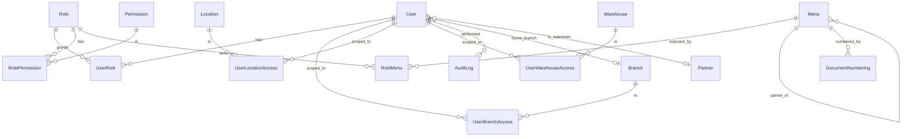

System-config entities (no hard relations): `Setting`, `FiscalPeriod`.
`AuditLog` (`sys_audit_logs`) records who-changed-what across all entities — in MVP (resolved §8).
Full field-level catalog: **[entities-m0-administrator.md](entities-m0-administrator.md)**.

## 6. ERD — m1 Master Data

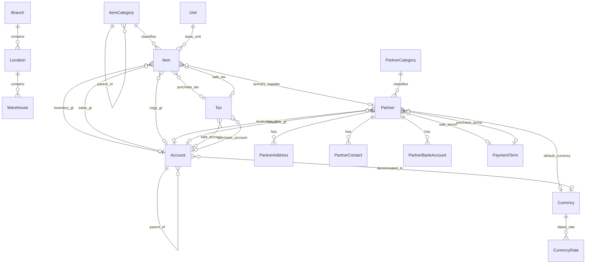

Full field-level catalog: **[entities-m1-master-data.md](entities-m1-master-data.md)**.

## 6.1 ERD — m2 Finance / GL (`fin`)

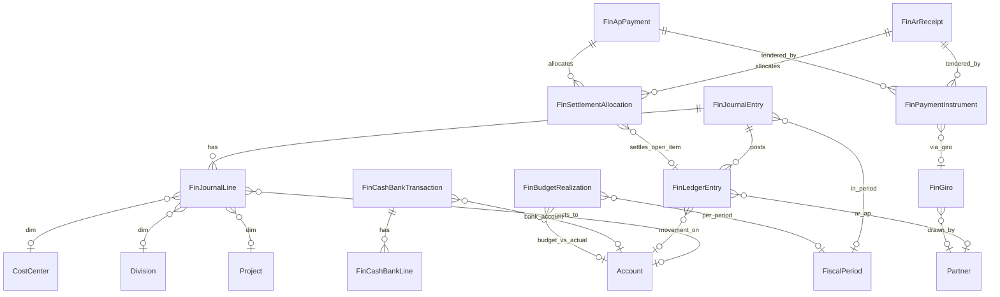

Accounting period reuses `sys_fiscal_periods`; GL dimension masters
(`md_cost_centers`/`md_divisions`/`md_subdivisions`/`md_projects`) live in `md`.
Full field-level catalog: **[entities-m2-finance.md](entities-m2-finance.md)**.
Enterprise extensions (§8 #30–#36, 2026-05-18): **[entities-m2-finance-enterprise.md](entities-m2-finance-enterprise.md)**.

## 6.1.1 ERD — m2 Finance Enterprise Extensions

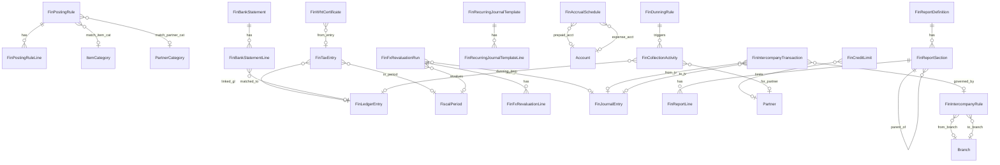

## 6.2 ERD — m3 Inventory (`inv`)

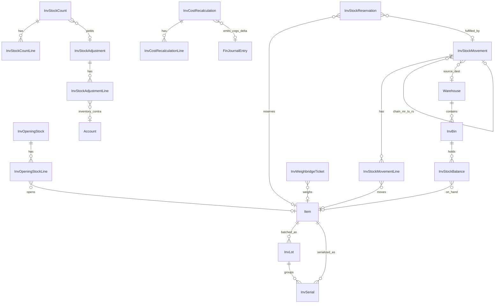

`InvStockBalance` is a **derived view** (opening + posted movements + adjustments),
not a written table. `InvCostRecalculation` is the perpetual **recost run** that
emits an auto `ADJUSTMENT` journal for the COGS delta (resolved §8 #18) — ledger
stays immutable. Period reuses `sys_fiscal_periods` (lifecycle now
`OPEN`/`SOFT_CLOSED`/`CLOSED`/`REOPENED`, §8 #20); dimensions reuse the m2
`md_*` masters. **Enterprise traceability (resolved §8 #24–26):** `inv_bins`
(structured WMS sub-location), `inv_lots` (batch/expiry, FEFO), `inv_serials`
(per-unit), `inv_stock_reservations` (available-to-promise). `inv_stock_balances`
now keyed by `(itemId, warehouseId, binId, lotId)`. `m3_dc`/`m3_pa` flagged out.
Full catalog: **[entities-m3-inventory.md](entities-m3-inventory.md)**.

## 6.3 ERD — m4 Purchasing (`pur`)

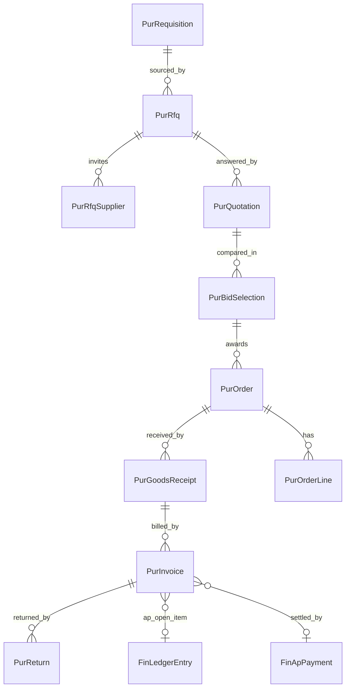

Each chain doc shares «PurchaseDocHeader»/«PurchaseDocLine» + line tables.
**Payment/settlement reuses `fin_ap_payments`/`fin_payment_instruments`/
`fin_settlement_allocations`** (no `pur_payment*` tables; +4 optional FX/term
columns flagged onto `fin_ap_payments`). `m4_ipc`/`m4_pie` folded/secondary.
Full catalog: **[entities-m4-purchasing.md](entities-m4-purchasing.md)**.

## 6.4 ERD — m5 Sales / AR (`sls`)

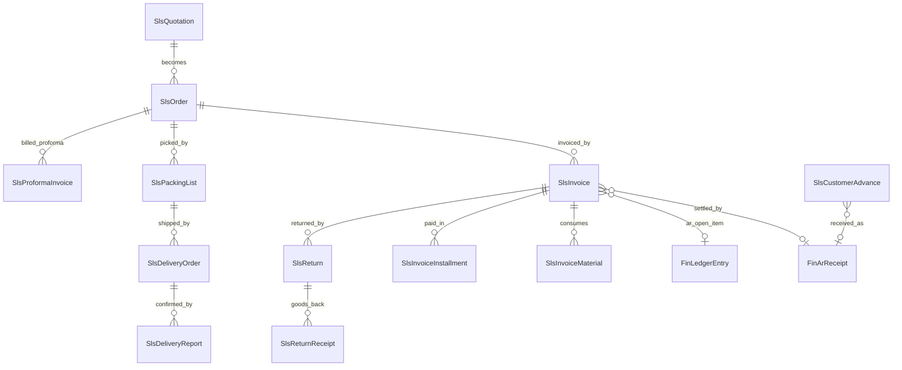

Mirror of m4: «SalesDocHeader»/«SalesDocLine» reuse the purchase shapes
(customer-side). **Payment/settlement reuses `fin_ar_receipts`/
`fin_payment_instruments`/`fin_settlement_allocations`** (no `sls_payment*`
tables; same +4 FX/term cols flagged onto `fin_ar_receipts`). `m5_cl`/`m5_spa`
(loyalty→`pos`)/`m5_rp` flagged out. Full catalog:
**[entities-m5-sales.md](entities-m5-sales.md)**.

## 6.5 ERD — m6 Manufacturing (`mfg`)

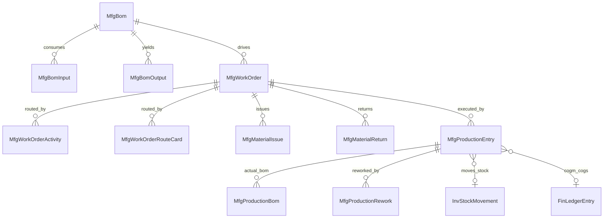

Every doc has input (consumed) + output (produced) line sets sharing
«MfgDocHeader»/«MfgInputLine»/«MfgOutputLine». Source = SQL dump (m6 not in
semantic-schema). Posting flows to `inv` (stock) + `fin` (COGM/COGS). Machine
master deferred. Full catalog:
**[entities-m6-manufacturing.md](entities-m6-manufacturing.md)**.

## 6.6 ERD — m7 Fixed Assets (`fa`)

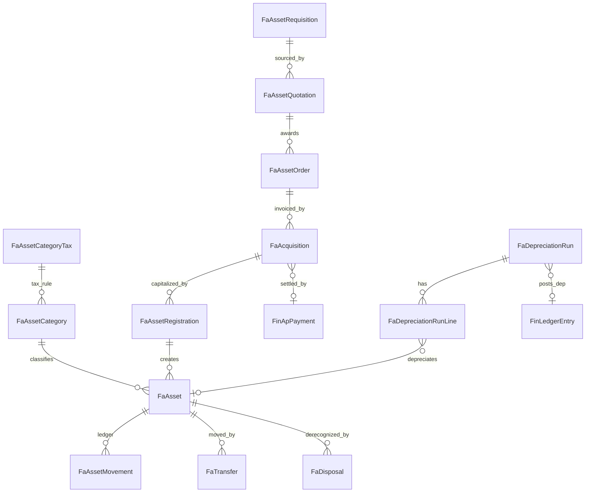

Acquisition chain reuses «PurchaseDocHeader» + «AssetLine»; AT payment reuses
`fin_ap_payments`. `fa_asset_movements` is an append-only per-asset ledger.
Asset-ops long tail flagged/deferred. Source = SQL dump. Full catalog:
**[entities-m7-fixed-assets.md](entities-m7-fixed-assets.md)**.

## 6.8 ERD — Planning / MRP-lite (`pln`)

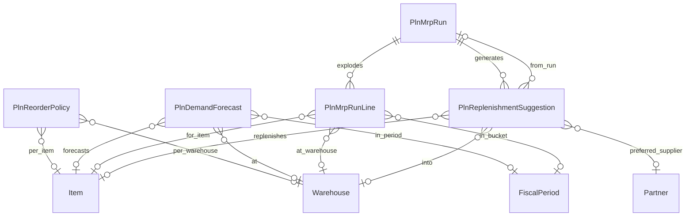

> **Inputs**: `sls_orders` + `mfg_work_orders` (demand) · `inv_stock_balances`
> − `inv_stock_reservations` + open `pur_orders` (supply snapshot).
> **Output**: suggestions convert to `pur_requisitions` / `mfg_work_orders` /
> `inv_stock_movements` (TRANSFER) on approval — `pln` never posts GL directly.
> Reorder params fall back to `md_items.minStock`/`maxStock`/`reorderQty` when no
> policy row exists. Full catalog:
> **[entities-pln-planning.md](entities-pln-planning.md)**.

## 6.7 ERD — m12 POS / Retail & Promotions (`pos`)

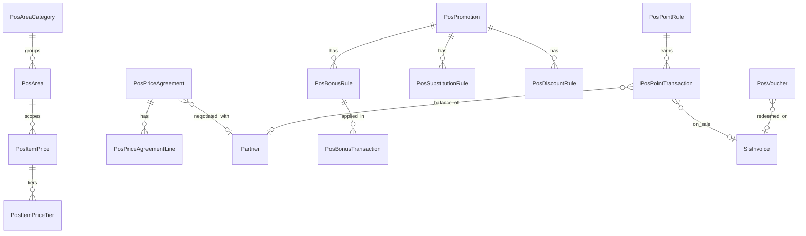

Realizes the deferred **tiered pricing** (§8 #3) as `pos_item_prices`(+tiers)/
`pos_price_agreements`. POS sale **reuses `sls_invoices`** (`channel = POS`;
+4 cols flagged). Config reuses `sys_settings`; stock transfer reuses `inv`.
⚠ Source = VB ws + Flex (m12 not in semantic-schema/SQL) — **inferred fields,
verify before Prisma**. Full catalog:
**[entities-m12-pos.md](entities-m12-pos.md)**.

---

## 7. Integration into `apps/api-gateway` (shared DB)

The user chose to extend the existing api-gateway Prisma schema. That schema **already
defines `User` (`@@map("m0_users")`) and `Menu` (`@@map("m0_menu")`) repurposed for the
Althea clinic.** A clean ERP cannot reuse those without coupling clinic + ERP concerns.

**Recommended strategy — namespaced ERP models:**

- Prisma model names prefixed `Erp*` (e.g. `ErpUser`, `ErpRole`, `ErpMenu`, `ErpItem`,
  `ErpPartner`, `ErpAccount`) to avoid Prisma model-name collisions.
- Physical tables in **semantic-domain namespaces** via `@@map` — `sys_*` (system
  config: `sys_menus`, `sys_settings`, `sys_document_numberings`, `sys_fiscal_periods`),
  `adm_*` (identity & access: `adm_users`, `adm_roles`, `adm_user_roles`, …),
  `md_*` (master data: `md_items`, `md_partners`, `md_accounts`, …). **No `erp_`
  prefix, no numeric `m<n>` segment.** Coexists with platform `m0_*`, `m1_*`,
  `clinic_*` — domain namespaces don't intersect platform prefixes. See
  [web-erp/CLAUDE.md §1](../CLAUDE.md).
- ERP migrations live in the same `prisma/migrations/` history; name them `erp-*`
  (e.g. `erp-core-sys-adm-md`) so the boundary is auditable. (Per CLAUDE.md §6, a
  real migration must be run *after* approval — not in this phase.)

This keeps one Postgres instance/connection while isolating the ERP domain. The alternative
(reuse the existing `User`/`Menu`) is documented as an open decision in §8.

---

## 8. Resolved decisions (2026-05-17)

Authoritative decision log; the rest of this set reflects it. #1–17 resolved in two
`AskUserQuestion` rounds (2026-05-17); #18–21 added the same day from the m2 `fin`
design test (HPP recalculation / periodic journal / non-disruptive input). One item
re-opened — see **§8.1**.

| # | Decision | Outcome | Effect on design |
| --- | --- | --- | --- |
| 1 | ERP `User` vs clinic `User` | **Separate `ErpUser` / `adm_users`** | Confirms current design; ERP auth decoupled from Althea (CLAUDE.md §1). |
| 2 | Surrogate PK type | **`BigInt @default(autoincrement())`** | **Changed** from `Int`. Every ERP PK/FK is `BigInt` — diverges from api-gateway `Int`; cross-table joins to platform tables must cast. |
| 3 | Audit log / change history | **In MVP** — `sys_audit_logs` (`ErpAuditLog`) | **Added.** New entity + `AuditAction` enum; +1 table. Removed from §9 deferred. |
| 4 | Per-user data scoping | **In MVP** | Confirms current design — `UserBranch/Location/WarehouseAccess` kept. |
| 5 | Partner customer/supplier duality | **Boolean flags** | Confirms current design — `isCustomer`/`isSupplier`/`isSalesman`. |
| 6 | FiscalPeriod scope | **Global** — unique `(year, periodNo)` | Confirms current design; no branch dimension. |
| 7 | `legacyCode` per master | **Add** — nullable, indexed | **Changed.** Added to global conventions (§3) + every `md_*` master + `sys_*`/`adm_*` masters; for CDC/ETL backfill. |
| 8 | Currency rates | **Dated `CurrencyRate` table now** | **Changed.** `Currency.exchangeRate` snapshot removed; new `CurrencyRate(currencyId, rateDate, rate)` (1:N). +1 table. |
| 9 | GL multi-dimension (branch/location/division on COA) | ~~Deferred~~ → **SUPERSEDED by #14** | Originally deferred for the m0+m1 MVP; the m2 `fin` decision (#16) brings full GL dimensions in. |
| 10 | Tiered pricing (10 price/discount tiers, `m1_contact_price`) | **Deferred** | Single `salePrice`/`purchasePrice`; later `ItemPrice`/`PartnerPrice` phase. |
| 11 | ItemType | **Enum** (not master table) | Confirms current design; switch to table only if user-defined types needed. |
| 12 | Partner bank | **Separate `md_partner_bank_accounts` (1:N)** | Confirms current design. |
| 13 | ItemCategory nesting | **Nested** (optional self-ref `parentId`) | Confirms current design. |
| 14 | Post-MVP module scope | **Roadmap all modules first** (coarse), deep catalog per module after review | New `module-roadmap.md` maps legacy m2–m12 → semantic domains. |
| 15 | Per-module design depth | **Modern core subset** (not legacy 1:1) | Unify legacy doc variants; `riwayat_*` → `sys_audit_logs`; normalized line tables. |
| 16 | GL multi-dimension (revisits #9) | **IN** — full analytic dimensions on journal lines | Adds `md_cost_centers`/`md_divisions`/`md_subdivisions`/`md_projects` to `md` (org-hierarchy masters un-deferred). |
| 17 | Domain naming for new modules | `fin`,`inv`,`pur`,`sls`,`mfg`,`fa`,`bi`,`pos` | Semantic per-function (CLAUDE.md §1); legacy m11 clinic vertical **excluded** (Althea); m9 none; m10 needs study. |
| 18 | Inventory accounting & HPP recalculation | **Perpetual + recost direct-update** *(revised by #23)* | COGS booked per transaction; backdated/cost-affecting posts trigger a **recost run** (`inv_cost_recalculations`) that **directly updates `debit`/`credit` on affected COGS `fin_ledger_entries` rows** (not emit a new ADJUSTMENT journal). Neraca + Laba Rugi auto-fix after recost. Audit trail: each updated row stamped `recostedAt`/`recostedById`/`recostedByRunId`; per-item before→after in `inv_cost_recalculation_lines`. `inv_stock_balances` derived view stays as source of qty+cost truth. +1 `inv_*` table + `CostRecalcStatus` enum. |
| 19 | Costing method made explicit | **Global setting, default `AVG`** | New `CostingMethod` enum (`AVG`/`FIFO`/`STD`); held as `sys_settings` key `inventory.costing_method` (default `AVG` = moving-average). Not per-item. Recost logic must be method-aware. |
| 20 | Period lifecycle for non-disruptive input | **Add `SOFT_CLOSED` + `REOPENED`** | `FiscalPeriodStatus` → `OPEN`→`SOFT_CLOSED`→`CLOSED`→`REOPENED`. `FiscalPeriod` gains reopen-audit fields. Operational docs keep posting while accountant finalizes; matrix `JournalType × FiscalPeriodStatus` defined in `entities-m2-finance.md`. Invariant added: `fiscalPeriodId` ≡ period containing `entryDate`. |
| 21 | Period-close process entity & `JournalType.CLOSING` | **RESOLVED — model penuh** | `fin_period_closings` run entity modeled in `entities-m2-finance.md`. Auto generates `JournalType.CLOSING` JV + roll laba ditahan. `PeriodCloseStatus` enum (`PENDING`/`IN_PROGRESS`/`COMPLETED`/`FAILED`). Reopenable; audit fields on both `sys_fiscal_periods` and `fin_period_closings`. |

| 22 | Edit dokumen yang sudah POSTED | **Diizinkan — dengan notifikasi recost** | Dokumen `POSTED` (GR, invoice, dll) bisa diedit langsung. Sistem otomatis: (1) reverse `fin_ledger_entries` lama untuk dokumen itu, (2) post ulang dengan nilai baru, (3) buat `inv_cost_recalculations` dengan `status = PENDING`. UI menampilkan notifikasi *"Periode X perlu Recost"* selama ada run `PENDING`. Audit trail via `sys_audit_logs`. |
| 23 | Recost direct-update ke `fin_ledger_entries` | **Recost menulis langsung ke ledger** | Recost run **tidak emit `JournalType.ADJUSTMENT`** baru — ia langsung update `debit`/`credit` pada baris COGS yang ada di `fin_ledger_entries`. `fin_ledger_entries` bukan lagi fully immutable: `debit`/`credit` bisa di-update oleh recost run yang sah. Setiap baris yang di-update di-stamp `recostedAt`/`recostedById`/`recostedByRunId`. Per-item before→after di `inv_cost_recalculation_lines`. Implikasi: posting matrix tidak lagi punya kolom "Recost ADJUSTMENT". |
| 24 | Lot/Batch & Serial tracking di `inv` | **IN — lot + serial penuh** | +2 master `inv_lots` (batch/expiry, FEFO, recall lineage) + `inv_serials` (per-unit, status & lokasi). Enum baru `LotStatus`/`SerialStatus`. FK opsional `lotId`/`serialId` di semua line tabel `inv`. Per-item flag `isLotTracked`/`isSerialTracked` di `md_items`. Lineage `originGoodsReceiptId` → `pur` (2026-05-18). |
| 25 | Stock reservation / available-to-promise | **IN core** | +1 `inv_stock_reservations` (soft allocation, tidak gerak stok/GL). ATP = on-hand − Σ reservasi `ACTIVE`. Dikonsumsi `sls` delivery / `mfg` material issue (flip `FULFILLED`). Enum `ReservationStatus` (2026-05-18). |
| 26 | Bin/lokasi rak | **Master `inv_bins`** | +1 master sub-lokasi gudang terstruktur (putaway/picking); string `binLocation` lama digantikan FK `binId` (nullable, untuk item ber-flag `isBinTracked`). `inv_stock_balances` di-key ulang `(itemId, warehouseId, binId, lotId)` (2026-05-18). |
| 27 | Sales pricing engine SSOT (m5 `sls`) | **Reuse `pos` — TANPA price list di `sls`** | `sls` adalah **konsumen** harga; sumber kebenaran tunggal = `pos_contact_prices` + `pos_category_discounts` (m12 `pos`, lih. [entities-m12-pos.md](entities-m12-pos.md)). Tidak ada tabel harga/diskon di `sls`. Konsisten dgn #10 (tiered pricing → fase `pos`). Mencegah dua SSOT harga (2026-05-18). |
| 28 | Cakupan enterprise tambahan m5 (credit mgmt / commission / target-quota / blanket order / CRM pipeline) | **Ditinjau — DIDEFER, tidak masuk core m5** | Direview 2026-05-18; user pilih *skip* untuk MVP/core. Tidak dimodelkan sekarang: credit-limit/hold, `sls_commission_*`, target-vs-realisasi, blanket/call-off order, CRM funnel. CRM pra-quotation = **out of ERP scope** (mulai dari Quotation). Revisit per-kebutuhan, bukan diam-diam masuk. |
| 29 | Planning / MRP-lite domain | **Domain `pln` baru — MRP-lite** | 5 entitas: `pln_reorder_policies` (per item/warehouse, lot size method), `pln_demand_forecasts` (manual/AI/kontrak), `pln_mrp_runs`(+lines) (explosion run, supply/demand worksheet), `pln_replenishment_suggestions` (action card PURCHASE/MANUFACTURE/TRANSFER → konversi ke `pur_requisitions`/`mfg_work_orders`/`inv_stock_movements` saat approved). 4 enum baru. `pln` tidak pernah post ke `fin` langsung. ATP view = `inv_stock_balances` − reservasi + scheduled receipts. No legacy equivalent. Full catalog: `entities-pln-planning.md` (2026-05-18). |
| 30 | Account Determination engine | **IN — `fin_posting_rules` + `fin_posting_rule_lines`** | Tabel aturan posting terpusat menggantikan akun hardcode di `md_items`/`md_partners`. Matching: `module × eventType × branchId? × itemCategoryId? × partnerCategoryId?` + priority. Setiap rule punya N leg `(accountId, isDebit, legName)`. Enum `PostingEvent` (24 event types). 2 entitas baru. (2026-05-18) |
| 31 | Tax sub-ledger (PPN + PPh) | **IN — `fin_tax_entries` + `fin_withholding_tax_certificates`** | Sub-ledger per-transaksi untuk rekap e-Faktur PPN dan Bukti Potong PPh (e-Bupot). Enum `TaxEntryType` (8 jenis), `TaxEntryStatus` (4), `WhtCertStatus` (2). 2 entitas baru. (2026-05-18) |
| 32 | FX Revaluation run | **IN — `fin_fx_revaluation_runs` + `fin_fx_revaluation_lines`** | Run periodik revaluasi saldo AR/AP/bank valas ke kurs penutup; generate jurnal unrealized gain/loss otomatis. Enum `FxRevaluationStatus` (4). 2 entitas baru. (2026-05-18) |
| 33 | Bank Reconciliation + Recurring/Accrual | **IN — 5 entitas baru** | Bank rec: `fin_bank_statements` + `fin_bank_statement_lines` (impor rekening koran + matching ke GL). Recurring: `fin_recurring_journal_templates` + `fin_recurring_journal_template_lines` (jurnal berkala). Accrual: `fin_accrual_schedules` (amortisasi prepaid). Enum `BankStatementStatus`, `RecurringFrequency`, `RecurringStatus`. (2026-05-18) |
| 34 | Financial Report Definitions | **IN — `fin_report_definitions` + `fin_report_sections` + `fin_report_lines`** | Layout laporan keuangan yang bisa dikonfigurasi tanpa coding (Neraca, L&R, Arus Kas). Memetakan range CoA / akun spesifik ke baris laporan. Formula lines untuk subtotal. Enum `FinancialReportType` (4), `ReportLineType` (5). 3 entitas baru. (2026-05-18) |
| 35 | Credit Limit & Collection Management | **IN — `fin_credit_limits` + `fin_dunning_rules` + `fin_collection_activities`** | Batas piutang per customer dengan action WARN/BLOCK/REQUIRE_APPROVAL; dunning rules berbasis hari keterlambatan; log aktivitas penagihan. Enum `CreditLimitAction`, `CollectionActivityType`, `CollectionStatus`, `DunningLevel`. 3 entitas baru. (2026-05-18) |
| 36 | Inter-branch / Consolidation | **IN — `fin_intercompany_rules` + `fin_intercompany_transactions`** | Konfigurasi pasangan akun due-from/due-to antar branch; record transaksi lintas cabang dengan JV di kedua sisi; eliminasi saat konsolidasi. Enum `IntercompanyStatus` (3). 2 entitas baru. (2026-05-18) |
| 37 | 3-way match di `pur_invoices` | **IN — `matchStatus ◆ MatchStatus`** | Kolom baru di `pur_invoices`: `matchStatus` (`PENDING`/`MATCHED`/`MISMATCH`/`WAIVED`). AP posting diblokir sampai status `MATCHED` atau `WAIVED`. Sistem memvalidasi kesesuaian qty/harga antara PO ↔ GR ↔ Invoice. Enum `MatchStatus`. Column-level only, no new tables. (2026-05-18) |
| 38 | QC qty di `pur_goods_receipt` lines | **IN — 4 kolom QC per baris GR** | Delta kolom di `pur_goods_receipt` lines: `acceptedQty`, `rejectedQty`, `quarantineQty` (Decimal 19,4) + `qcStatus ◆ QcStatus` (`PENDING` saat dibuat). Stok naik hanya sebesar `acceptedQty`; `rejectedQty` menjadi seed baris `pur_returns`. Enum `QcStatus`. Column-level only. (2026-05-18) |
| 39 | mfg → pur auto-PR | **IN — `workOrderId ○ ➜ MfgWorkOrder` di `pur_requisitions`** | FK opsional di `pur_requisitions.workOrderId` — menandai PR yang dipicu kekurangan material Work Order. Menutup loop produksi→pengadaan; simetris dengan `salesQuotationId` (demand dari sales). Column-level only. (2026-05-18) |
| 40 | Approval workflow — generik `sys_approval_*` | **IN — engine generik domain `sys`** | Approval engine lintas-modul (`pur` Requisition/PO, `sls` Order, `fin` journal, `fa` requisition, dll). Tidak ada `pur_approval*` tabel — dokumen `pur` hanya membawa `status` hasil approval. Desain `sys_approval_*` = deliverable tersendiri domain `sys`. (2026-05-18) |
| 42 | `sys_menus` seed | **IN — full catalog dari aktif m0_menu di `apps/api-gateway/prisma/seed-erp.ts`** | `seedMenus()` idempoten (upsert by `code`), dipanggil dari `main()`. Scope = **semua entry aktif m0+m1** = 97 entries total (2 MODULE + 8 GROUP + 87 ITEM). M0: `M0.CFG` (14 items, lgc 0-2), `M0.ADM` (10 items, lgc 0-25), `M0.SYS` (5 items, lgc 0-26). M1: `M1.ORG` (9), `M1.ITEM` (18), `M1.PARTNER` (8), `M1.FIN` (5), `M1.REF` (11), `M1.PROD` (6). `legacyCode` = `<mnmoduleid>-<mnid>`. Seed bersifat additive-upsert; entry lama tetap di DB. Eksekusi `npm run db:seed` di env dgn akses DB. (2026-05-19) **Update (2026-05-19, opsi A):** ditambah **12 MODULE root stub** untuk modul legacy m2–m14 (no m9) — `M2 Finance & Accounting`, `M3 Warehouse & Inventory`, `M4 Purchasing`, `M5 Sales`, `M6 Production`, `M7 Fixed Assets`, `M8 Dashboard`, `M10 HR & Payroll`, `M11 Hospital`, `M12 Point of Sales`, `M13 Academic`, `M14 Cooperative`. Roots-only (tanpa GROUP/ITEM), `path` null (sidebar tampil tapi belum navigable), `legacyCode` = `<n>-1`. **Total sys_menus: 97 → 109 entries (2 → 14 MODULE).** Konsisten dgn MVP m0+m1 (item-level m2–m14 ditunda sampai modul fungsionalnya dibangun). `adm_role_menus` otomatis di-isi via loop existing di `seedRoleAndUser()` — SUPERADMIN dapat semua 109 entries. **Update (2026-05-20):** M2 Finance & Accounting di-expand dari 5 entries (terlalu ringkas) → 1 GROUP `M2.TX` + 12 ITEM transaksi (CR/CD/BD/CB/RG/SG/RGC/SGC/RM/SM/GJ/AJ) + 1 GROUP `M2.RPT` + 1 ITEM `General Ledger` = **+14 entries → total 123**. Title English, `legacyCode` simpan 2–3 huruf legacy (`CR`, `CD`, dst). Paritas dengan legacy m2-finance 13 transaction modules. Detail tabel di `apps/web-erp/CLAUDE.md §2.17`. |
| 41 | Enterprise adm+sys extensions | **IN — 6 entitas baru** | Session & auth: `adm_user_sessions` (refresh token, force logout, audit trail) + `adm_password_policies` (min-length, complexity, lockout, concurrent-session, timeout; kode `DEFAULT` / `ADMIN_STRICT`; satu row `isDefault`). Preferences: `adm_user_preferences` (theme, language override, timezone, dateFormat, numberFormat, pageSize, defaultBranch; 1:1 dengan user, upsert). Notifikasi: `sys_notifications` (in-app alert approval/recost/stok/period; append-only; TTL via `expiresAt`) + `sys_email_templates` (template multi-channel `EMAIL`/`WHATSAPP`/`IN_APP`/`SMS` × multi-language, `{{placeholder}}` syntax; unique `[code, channel, languageCode]`). Lokalisasi: `sys_languages` (BCP 47 `id`/`en`; `isDefault`; direferensikan oleh `adm_users.language`, `adm_user_preferences.language`, `sys_email_templates`). Enum baru: `NotificationChannel`. Total adm+sys: 14 → **20 entitas**. (2026-05-18) |
| 43 | Format kode akun CoA (`md_accounts.code`) | **`NNNN.NN.NNN` (4-2-3, dual dot, 11 char)** | **Changed (2026-05-27).** Sebelumnya 4 digit polos (`1101`); diganti karena (a) cabang legitimate legacy (mis. Beban Tenaga Kerja 14 anak, HPP 14 anak, Penjualan 13 anak) overflow slot 1 digit; (b) akuntan ex-MyERP+ familiar dengan format multi-segment `NNNNNN.NNN` (legacy 9 digit); (c) enterprise convention (SAP/Oracle/Accurate/Zahir) selalu pakai separator. Layout: 4 digit prefix = kelompok-grup PSAK (`1xxx` Aset, `2xxx` Liab, dst), 2 digit middle = sub-grup (max 99 anak per cabang), 3 digit leaf = nomor urut (mirror legacy `.NNN`). HEADER pakai trailing zero `NNNN.00.000`; POSTABLE default `NNNN.01.001`. Hierarki tetap via `parentId` + `level` (FK), bukan via parsing string. Cabang legacy bermisuse (mis. `210108.000` 72 anak supplier) tetap dipindah ke subledger via `md_partners.payableAccountId` — bukan jadi leaf CoA. Implementasi: regex `@Matches(/^\d{4}\.\d{2}\.\d{3}$/)` di `CreateErpAccountDto` + FE form validator + seed `seed-erp-accounts.ts` (158 akun, MaxLength code 50→11). |

**Changed vs prior draft:** #2 (BigInt), #3 (audit log added), #7 (legacyCode added),
#8 (CurrencyRate table), #18–20 (recost HPP + costing method + period tiers),
#22–23 (edit posted doc + recost direct-update, 2026-05-18),
#24–26 (lot/serial + reservation/ATP + `inv_bins` master, 2026-05-18 —
`inv` jadi WMS-capable; m3 inv: 13 → **17** entitas),
#27–28 (sales pricing SSOT = reuse `pos`; enterprise extras m5 didefer, 2026-05-18),
#29 (domain `pln` MRP-lite baru, 2026-05-18 — 5 entitas + ATP view),
**#30–36 (fin enterprise extensions: account determination + tax sub-ledger + FX
revaluation + bank rec + recurring/accrual + report definitions + credit/collection
+ inter-company, 2026-05-18 — `fin` total: 12 core → 31 entitas)**,
**#37–40 (pur enterprise additions: 3-way match + QC qty + auto-PR mfg→pur +
approval generik `sys_approval_*`, 2026-05-18 — column-level only, no new tables)**,
**#41 (enterprise adm+sys extensions: `adm_user_sessions` + `adm_password_policies` +
`adm_user_preferences` + `sys_notifications` + `sys_email_templates` + `sys_languages`,
2026-05-18 — adm+sys total: 14 → 20 entitas; enum `NotificationChannel` baru)**.
Items #1, #4–6, #9–13 ratify the existing `db-design/` model.
The retired `DB-DESIGN.md` rev. 3 divergences are now fully reconciled.

### 8.1 ~~Open decision~~ — resolved 2026-05-18

| # | Question | Status | Notes |
| --- | --- | --- | --- |
| 21 | Period-close process: dedicated `fin_period_closings` run entity + `JournalType.CLOSING` (generated closing journal, retained-earnings roll, reopenable)? | **RESOLVED (2026-05-18) — Opsi A model penuh** | `fin_period_closings` modeled in `entities-m2-finance.md`. `JournalType.CLOSING` added to enum. Roll laba ditahan otomatis saat `COMPLETED`; run reopenable. |
| — | Enterprise finance extensions (#30–#36) | **RESOLVED (2026-05-18) — semua IN** | Account Determination, Tax sub-ledger, FX Revaluation, Bank Rec, Recurring/Accrual, Report Definitions, Credit Limit & Collection, Inter-branch/Consolidation — semua dikonfirmasi user 2026-05-18. Catalog: `entities-m2-finance-enterprise.md`. **Semua open decision sekarang resolved** — siap untuk Prisma fin bila user beri go-ahead. |

### 8.2 ~~Open decision~~ — CoA custom template per-klien (resolved 2026-05-27)

| # | Question | Status | Notes |
| --- | --- | --- | --- |
| 44 | Apakah klien boleh override default CoA template dengan template miliknya — misal **flat 5 digit** (`12345`), **flat 7 digit** (`1234567`), atau format multi-segment selain `NNNN.NN.NNN`? | **RESOLVED (2026-05-27, opsi B) — format dinamis dari `sys_settings`** | **Implementasi (2026-05-27).** Single-tenant context: format CoA jadi **setting global** (`sys_settings` group `account-code`, 2 row: `account_code_segments` JSON array + `account_code_separator` string). Default seed tetap `[4,2,3]` + `.` (PSAK 4-2-3, sama dengan #43). **Backend:** helper `apps/api-gateway/src/erp-accounts/account-code-format.ts` build `{pattern, maxLength, example}` dinamis; `ErpAccountsService.create()`/`update()` panggil `validateAccountCode()` (read setting + validate); `@Matches(/^\d{4}\.\d{2}\.\d{3}$/)` di `CreateErpAccountDto` **dihapus** — diganti `@MaxLength(30)` upper bound. Endpoint baru: `GET /erp/accounts/code-format` (active format + accountCount + locked) dan `PUT /erp/accounts/code-format` (`{segments, separator}` — 409 ConflictException bila `md_accounts.count > 0`, lock-after-data). **Frontend:** `accounts-form.tsx` pull format dari API (module-level cache + hook `useAccountCodeFormat`), validator regex + maxLength + placeholder semuanya dinamis. Halaman dedicated `/admin/account-code-format` (komponen `AccountCodeFormatPage` + `AccountCodePresetList` molecule) — segments editor 1–5 segmen × 1–12 digit, separator picker (`.`/`-`/`/`/tanpa), preset cepat (PSAK 4-2-3, flat 5/6/7, 4-3, 4-3-3, legacy 6-3), preview live, lock card saat ada akun. Seed `sys_menus` entry `M0.SYS.ACCT-CODE` di Administrator → System. **Skema #43 jadi default seed**, bukan hard-lock; #43 di-supersede oleh keputusan ini untuk kasus klien dengan template berbeda. Catatan praktis: ganti format **wajib** zero-state akun (server enforce); klien onboarding pilih format dulu **sebelum** import CoA / jalankan `seed-erp-accounts.ts`. Test plan: konfirmasi GET `/erp/accounts/code-format` mengembalikan `[4,2,3]+"."`, PUT dengan `[5]+""` saat zero accounts → sukses, PUT saat ada akun → 409, lalu coba POST `/erp/accounts` dengan kode format baru → 201 (atau 400 bila format lama). |

## 9. Deferred (intentionally NOT in this MVP)

Out of the **m0+m1 MVP slice** specifically (but most are now roadmapped — see below):
product attributes (brand/color/size/model/material), geography masters
(country/province/city), department/section sub-hierarchy, expedition,
price categories, transaction-note templates, approval workflow,
file/attachment manager, import/export tooling.
(Audit-log / change history is **now in MVP** — `sys_audit_logs`, resolved §8 #3.)

**No longer "just deferred" — now roadmapped** (resolved §8 #14): the legacy
transactional modules m2–m12 (Finance, Inventory, Purchasing, Sales, Manufacturing,
Fixed Assets, BI, POS) are mapped at roadmap depth in
**[module-roadmap.md](module-roadmap.md)**. GL dimension masters
(`md_cost_centers`/`md_divisions`/`md_subdivisions`/`md_projects`) are **un-deferred**
(resolved §8 #16). Per-module field catalogs are produced sequentially after review.
Legacy lineage for m1's unmapped masters: **[legacy-mapping.md](legacy-mapping.md)**.

**Explicitly deferred from `pur` core (2026-05-18):**
- **Blanket / Contract PO** — PO type + call-off release; adopsi bila ada pola kontrak supplier rutin.
- **Encumbrance / budget commitment** — PR/PO membebani anggaran sebelum realisasi (`committed` vs `actual` di `fin_budget_realizations`); tunda ke fase `fin` lanjutan.
- **Landed cost** — alokasi freight/duty/asuransi ke `unitCost` item; butuh desain alokasi tersendiri (fase terpisah).
- **Vendor scorecard / evaluation** — KPI supplier; masuk fase `bi` (Business Intelligence).
- **Supplier price list / kontrak harga** — ikut fase pricing/`pos` (§8 #10 tiered pricing).
