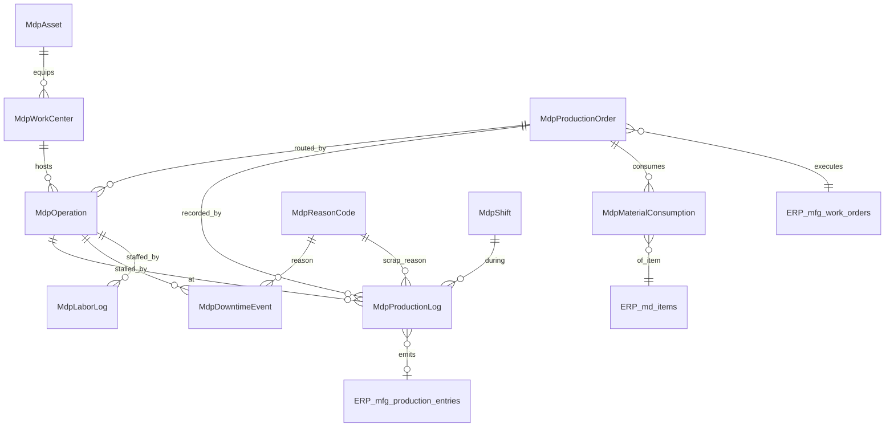

# MES — Manufacturing Execution: Entity Catalog (`mes` + foundation `mdp`/`eam`)

> Status: **PRISMA WRITTEN + MIGRATED (2026-06-28)** — schema at
> `apps/api-gateway/prisma/schema/mdp-mes.prisma`; migration
> `20260628_001_mdp_mes` applied to live DB (additive: 10 tables + 5 enums,
> 0 DROP) via scoped `db execute` + `migrate resolve` (team's unrelated pending
> migration left untouched). Catalog below = the design that was realized.
>
> **Backend CRUD COMPLETE (2026-06-28):** all 6 `mes_*` entities guarded by
> `ErpJwtAuthGuard` at `/api/mdp/{production-orders,operations,production-logs,
> material-consumptions,downtime-events,labor-logs}` (all verified 401). Highlights:
> `mes_production_logs` recomputes parent-order rollup per MES-4; `mes_downtime_events`
> + `mes_labor_logs` derive `durationSeconds` on close; `mes_operations` goodQty/scrapQty
> are manual-entry (no auto-rollup from logs in MVP); `mes_material_consumptions`
> `itemId`/`sourceBinId` are cross-app scalar (not asserted), `postingStatus` stays
> PENDING until the ERP-emit worker (open #3). **All MES UI still pending** except
> production-orders (list+create). No new migration — tables existed since
> `20260628_001_mdp_mes`.
> Date: 2026-06-27 · Product: Senti MDP, `apps/web-mdp`. Anchor module (build #1).
> Extends [README.md](README.md) + [module-roadmap.md](module-roadmap.md).
> **Scope:** MES core (manual-entry first — no machine/SCADA ingestion) **plus**
> the minimal `mdp`/`eam` foundation tables MES depends on. Full EAM registry
> and `mdp` config catalogs are separate docs (later); only the slice MES needs
> is defined here.

Conventions inherited verbatim from [web-erp/db-design §3](../../web-erp/db-design/README.md):
BigInt PK, `code`/`name`, `deletedAt` soft-delete, `isActive` where meaningful,
audit quartet (`createdAt`/`updatedAt`/`createdById`/`updatedById`),
`Decimal(19,4)` money/qty, `Decimal(9,4)` rate, UTC `timestamptz`, Postgres
enums, `metadata Json?`. Models are `PascalCase` prefixed **`Mdp`** + `@@map`.

**Legend:** 🔑 unique · ○ nullable/optional · ➜ FK · ◆ enum · ⮕ **cross-app**
scalar `BigInt` FK to ERP (no DB-level relation, `@@index` only — keeps domains
decoupled, per README §2).

---

## ERD

`MdpProductionOrder` **executes** an ERP `mfg_work_orders` row (planning lives in
ERP); `MdpProductionLog` is the execution result MES **emits** for ERP to post
to `mfg_production_entries` + `inv_*` (contract in §Integration).

---

## A. Foundation tables (minimal — MES dependencies)

### `eam_work_centers` → `MdpWorkCenter`

The production resource an operation runs at (line / cell / station). Full work-
center routing modeling stays light for the manual-entry MVP.

| Field | Type | Notes |
| --- | --- | --- |
| id | BigInt PK | |
| code 🔑 | String | e.g. `WC-CUTTING-01` |
| name | String | |
| assetId ○ ➜ | BigInt → MdpAsset | primary machine, if any |
| idealCycleSeconds ○ | Decimal(19,4) | per-unit ideal cycle (OEE performance basis) |
| isActive | Boolean | |
| metadata ○ | Json | |
| *(audit + deletedAt)* | | |

### `eam_assets` → `MdpAsset`  *(stub — full registry in entities-eam.md later)*

Maintained equipment master. Only the columns MES/downtime need now.

| Field | Type | Notes |
| --- | --- | --- |
| id | BigInt PK | |
| code 🔑 | String | asset tag |
| name | String | |
| erpFixedAssetId ○ ⮕ | BigInt → ERP `fa_assets` | optional financial twin |
| isActive | Boolean | |
| *(audit + deletedAt)* | | |

### `mdp_shifts` → `MdpShift`

| Field | Type | Notes |
| --- | --- | --- |
| id | BigInt PK | |
| code 🔑 | String | `SHIFT-1` |
| name | String | |
| startTime | String | `HH:mm` local (Asia/Jakarta) |
| endTime | String | `HH:mm`; crosses midnight allowed |
| isActive | Boolean | |
| *(audit + deletedAt)* | | |

### `mdp_reason_codes` → `MdpReasonCode`

Typed catalog for downtime / scrap / delay reasons (referenced by downtime
events and production-log scrap).

| Field | Type | Notes |
| --- | --- | --- |
| id | BigInt PK | |
| code 🔑 | String | `DT-CHANGEOVER` |
| name | String | |
| category ◆ | `ReasonCodeCategory` | DOWNTIME / SCRAP / DELAY / QUALITY / OTHER |
| isActive | Boolean | |
| *(audit + deletedAt)* | | |

---

## B. MES entities (`mes_*`)

### `mes_production_orders` → `MdpProductionOrder`

The shop-floor executable order. Mirrors / draws from an ERP work order but is
owned by MES (status reflects *execution*, not planning).

| Field | Type | Notes |
| --- | --- | --- |
| id | BigInt PK | |
| code 🔑 | String | `MO-YYMM-NNNN` |
| erpWorkOrderId ○ ⮕ | BigInt → ERP `mfg_work_orders` | source plan (nullable for ad-hoc) |
| itemId ⮕ | BigInt → ERP `md_items` | finished good produced |
| workCenterId ○ ➜ | BigInt → MdpWorkCenter | primary work center |
| plannedQty | Decimal(19,4) | target output |
| producedGoodQty | Decimal(19,4) | rollup from logs (denorm cache) |
| producedScrapQty | Decimal(19,4) | rollup from logs |
| uomCode ○ | String | unit (from item) |
| status ◆ | `MesOrderStatus` | RELEASED → IN_PROGRESS → … |
| plannedStartAt ○ | DateTime | |
| plannedEndAt ○ | DateTime | |
| actualStartAt ○ | DateTime | first log |
| actualEndAt ○ | DateTime | completion |
| branchId ○ ⮕ | BigInt → ERP `md_branches` | org dimension |
| notes ○ | String | |
| metadata ○ | Json | |
| *(audit + deletedAt)* | | |

### `mes_operations` → `MdpOperation`

Routing steps of an order, each at a work center. Sequenced.

| Field | Type | Notes |
| --- | --- | --- |
| id | BigInt PK | |
| productionOrderId ➜ | BigInt → MdpProductionOrder | parent |
| sequence | Int | step order |
| name | String | e.g. "Cutting" |
| workCenterId ➜ | BigInt → MdpWorkCenter | where it runs |
| status ◆ | `MesOperationStatus` | PENDING / IN_PROGRESS / COMPLETED / SKIPPED |
| plannedQty ○ | Decimal(19,4) | |
| goodQty | Decimal(19,4) | rollup |
| scrapQty | Decimal(19,4) | rollup |
| startedAt ○ | DateTime | |
| completedAt ○ | DateTime | |
| metadata ○ | Json | |
| *(audit + deletedAt)* | | |

### `mes_production_logs` → `MdpProductionLog`

The execution record (one entry per reporting event). **This is what ERP
ingests.** Manual entry: operator keys quantities + times.

| Field | Type | Notes |
| --- | --- | --- |
| id | BigInt PK | |
| productionOrderId ➜ | BigInt → MdpProductionOrder | |
| operationId ○ ➜ | BigInt → MdpOperation | |
| shiftId ○ ➜ | BigInt → MdpShift | |
| operatorId ○ ⮕ | BigInt → ERP `adm_users` | who reported |
| goodQty | Decimal(19,4) | |
| scrapQty | Decimal(19,4) | |
| reworkQty | Decimal(19,4) | |
| scrapReasonId ○ ➜ | BigInt → MdpReasonCode | category=SCRAP |
| startedAt | DateTime | |
| endedAt ○ | DateTime | |
| postingStatus ◆ | `MesPostingStatus` | PENDING → POSTED (to ERP) |
| erpProductionEntryId ○ ⮕ | BigInt → ERP `mfg_production_entries` | set on emit |
| postedAt ○ | DateTime | |
| notes ○ | String | |
| metadata ○ | Json | |
| *(audit + deletedAt)* | | |

### `mes_material_consumptions` → `MdpMaterialConsumption`

Components consumed against an order (drives ERP `inv_` issue at posting).

| Field | Type | Notes |
| --- | --- | --- |
| id | BigInt PK | |
| productionOrderId ➜ | BigInt → MdpProductionOrder | |
| operationId ○ ➜ | BigInt → MdpOperation | |
| itemId ⮕ | BigInt → ERP `md_items` | component |
| qty | Decimal(19,4) | consumed |
| uomCode ○ | String | |
| sourceBinId ○ ⮕ | BigInt → ERP `md_storage_bins` | issued from |
| postingStatus ◆ | `MesPostingStatus` | PENDING → POSTED |
| consumedAt | DateTime | |
| metadata ○ | Json | |
| *(audit + deletedAt)* | | |

### `mes_downtime_events` → `MdpDowntimeEvent`

Stoppages on an operation/work center, tagged with a reason (OEE availability).

| Field | Type | Notes |
| --- | --- | --- |
| id | BigInt PK | |
| productionOrderId ○ ➜ | BigInt → MdpProductionOrder | |
| operationId ○ ➜ | BigInt → MdpOperation | |
| workCenterId ➜ | BigInt → MdpWorkCenter | |
| assetId ○ ➜ | BigInt → MdpAsset | machine down |
| reasonId ➜ | BigInt → MdpReasonCode | category=DOWNTIME |
| type ◆ | `DowntimeType` | PLANNED / UNPLANNED |
| startedAt | DateTime | |
| endedAt ○ | DateTime | null = ongoing |
| durationSeconds ○ | Decimal(19,4) | derived on close |
| reportedById ○ ⮕ | BigInt → ERP `adm_users` | |
| notes ○ | String | |
| metadata ○ | Json | |
| *(audit + deletedAt)* | | |

### `mes_labor_logs` → `MdpLaborLog`

Operator time per operation (manual clock-in/out).

| Field | Type | Notes |
| --- | --- | --- |
| id | BigInt PK | |
| operationId ➜ | BigInt → MdpOperation | |
| operatorId ⮕ | BigInt → ERP `adm_users` | |
| shiftId ○ ➜ | BigInt → MdpShift | |
| startedAt | DateTime | |
| endedAt ○ | DateTime | |
| durationSeconds ○ | Decimal(19,4) | derived |
| metadata ○ | Json | |
| *(audit + deletedAt)* | | |

---

## C. Enums (new — to be added to README §4 on Prisma)

| Enum | Values |
| --- | --- |
| `MesOrderStatus` | `RELEASED`, `IN_PROGRESS`, `PAUSED`, `COMPLETED`, `CLOSED`, `CANCELLED` |
| `MesOperationStatus` | `PENDING`, `IN_PROGRESS`, `COMPLETED`, `SKIPPED` |
| `MesPostingStatus` | `PENDING`, `POSTED`, `FAILED` |
| `ReasonCodeCategory` | `DOWNTIME`, `SCRAP`, `DELAY`, `QUALITY`, `OTHER` |
| `DowntimeType` | `PLANNED`, `UNPLANNED` |

---

## D. Integration with ERP (L4 ↔ L3) — MES specifics

Per [README §4](README.md#4-integration-contract-l4-erp--l3-mdp--authoritative):

- **Read from ERP:** `mfg_work_orders` (the plan), `mfg_boms` (expected
  components), `md_items`, `md_storage_bins`, `adm_users`. All via scalar FK /
  read API; MES never writes ERP planning tables.
- **Emit to ERP:** on production-log post, MES produces a record ERP ingests as
  `mfg_production_entries` (good/scrap qty) + the implied `inv_` movements from
  `mes_material_consumptions`. MES stamps `erpProductionEntryId` / `postedAt`
  and flips `postingStatus` to POSTED.
- **Posting mechanism = open decision #3** (sync API call vs event/outbox).
  *Recommendation:* outbox table + worker (decouples MES UX from ERP latency,
  survives ERP downtime). Decide before the emit code, not before the schema.

---

## E. Open items for this module (resolve before MES Prisma)

| # | Item | Lean |
| --- | --- | --- |
| MES-1 | Production-order numbering: reuse ERP `sys_document_numberings` or MDP-local `mdp_document_numberings`? | MDP-local (MES owns its sequences). |
| MES-2 | Do operations come from ERP routing or are they entered in MES? | Manual in MES for MVP (ERP has no routing master surfaced). |
| MES-3 | Emit contract (open #3 global): sync vs outbox. | Outbox + worker. |
| MES-4 | Should `producedGoodQty`/`producedScrapQty` be stored (denorm cache) or always derived? | Store as cache, recompute on log change. |
| MES-5 | WIP/lot/serial tracking in MES (ERP has lot/serial). | Defer; link by item for MVP. |
