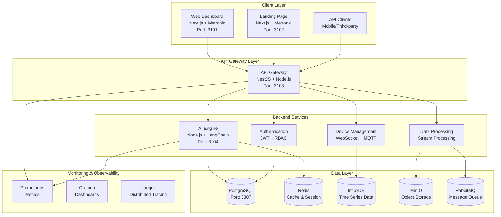

# Architecture Overview

Sentient Factory adalah platform manufaktur cerdas yang dibangun dengan arsitektur **microservices modern** menggunakan monorepo dengan pnpm workspaces dan TurboRepo untuk skalabilitas, keandalan, dan kemudahan pengembangan.

## System Architecture



## Core Components

### 1. Web Dashboard (Port: 3101)

- **Teknologi**: Next.js 14 + React + TypeScript
- **UI Framework**: Metronic Dashboard Template
- **Fungsi**: Dashboard administrasi utama untuk monitoring produksi, analisis data, dan manajemen sistem
- **Fitur**: Real-time charts, role-based views, responsive design

### 2. Landing Page (Port: 3102)

- **Teknologi**: Next.js 14 + React + TypeScript
- **UI Framework**: Metronic Landing Template
- **Fungsi**: Halaman marketing dan informasi produk untuk calon pelanggan
- **Fitur**: SEO optimized, high performance, conversion tracking

### 3. API Gateway (Port: 3103)

- **Teknologi**: NestJS + Node.js + TypeScript
- **Fungsi**: Single entry point untuk semua request klien
- **Fitur**: Rate limiting, JWT authentication, request validation, WebSocket support
- **Routing**: Load balancing, service discovery, API versioning
- **Architecture**: Modular, dependency injection, decorator-based

### 4. AI Engine (Port: 3104)

- **Teknologi**: Node.js + LangChain + TypeScript
- **Fungsi**: Pemrosesan AI dan orchestration agent
- **Model**: Predictive maintenance, quality control, optimization algorithms
- **Integrasi**: OpenAI, Anthropic, custom ML models

### 5. Authentication & Authorization

- **Teknologi**: JWT (JSON Web Tokens) + Role-Based Access Control (RBAC)
- **Fitur**: OAuth2 integration, multi-factor authentication, session management
- **Storage**: Redis untuk session storage dan token blacklisting

## Data Storage

### PostgreSQL (Port: 3307)

- **Purpose**: Penyimpanan data bisnis terstruktur
- **Database**: `myerpplus`
- **Credentials**:
  - Host: `127.0.0.1`
  - Port: `3307`
  - User: `app_user`
  - Password: `change_me`
- **Use Cases**: User management, production orders, inventory, transactions

### Redis (Port: 6379)

- **Purpose**: Caching, session storage, message broker
- **Use Cases**: API response caching, real-time notifications, queue management

### InfluxDB (Port: 8086)

- **Purpose**: Time-series data storage
- **Use Cases**: Sensor telemetry, real-time monitoring, historical trend analysis

### MinIO (Port: 9000)

- **Purpose**: Object storage (S3-compatible)
- **Use Cases**: Image/video storage, model files, document archives

### RabbitMQ (Port: 5672)

- **Purpose**: Message queue untuk event-driven architecture
- **Use Cases**: Async task processing, event broadcasting, workload distribution

## Monitoring & Observability

### Prometheus (Port: 9090)

- **Purpose**: Metrics collection dan monitoring
- **Metrics**: Application metrics, business KPIs, system resources

### Grafana (Port: 3000)

- **Purpose**: Data visualization dan dashboard
- **Dashboards**: Production metrics, system health, business intelligence

### Jaeger (Port: 16686)

- **Purpose**: Distributed tracing
- **Features**: Trace correlation, performance analysis, error tracking

## Development Architecture

### Monorepo Structure

```
sentient-factory/
├── apps/                          # Aplikasi yang dapat dijalankan
│   ├── web-dashboard/             # Next.js dashboard (Metronic)
│   ├── landing-page/              # Next.js landing page (Metronic)
│   ├── api-gateway/               # NestJS backend API
│   └── ai-engine/                 # Node.js AI service
├── packages/                      # Shared packages
│   ├── shared-types/              # TypeScript/Pydantic types
│   ├── ui-kit/                    # React components
│   └── logger/                    # Structured logging
├── docs/                          # Docusaurus documentation
├── infra/                         # Infrastructure configurations
├── scripts/                       # Helper scripts
└── config/                        # Configuration files
```

### Build System

- **Package Manager**: pnpm dengan workspaces
- **Build Tool**: TurboRepo untuk caching dan parallel execution
- **Language**: TypeScript untuk konsistensi dan type safety

## Communication Patterns

### Synchronous Communication

- **REST APIs**: HTTP/HTTPS untuk client-server communication
- **WebSocket**: Real-time bidirectional communication untuk live updates
- **gRPC**: High-performance inter-service communication (optional)

### Asynchronous Communication

- **Message Queues**: RabbitMQ untuk event-driven architecture
- **Pub/Sub**: Redis Pub/Sub untuk real-time notifications
- **Event Streaming**: Untuk data pipeline dan stream processing

## Security Architecture

### Network Security

- **API Gateway**: Single entry point dengan rate limiting dan DDoS protection
- **Private Network**: Database dan service berjalan di jaringan terisolasi
- **VPN Access**: Untuk administrative access ke environment production

### Data Security

- **Encryption**: TLS/SSL untuk data in transit, encryption untuk data at rest
- **Access Control**: Role-Based Access Control (RBAC) dengan granular permissions
- **Audit Logging**: Comprehensive audit trail untuk semua operasi sensitif

### Application Security

- **Input Validation**: Zod schema validation untuk semua API endpoints
- **Security Headers**: CSP, HSTS, X-Frame-Options
- **Secret Management**: Environment variables dengan encryption
