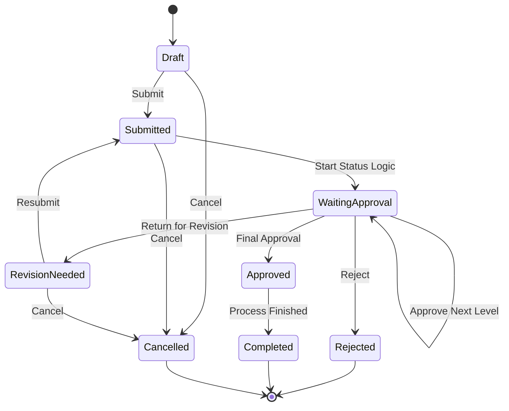
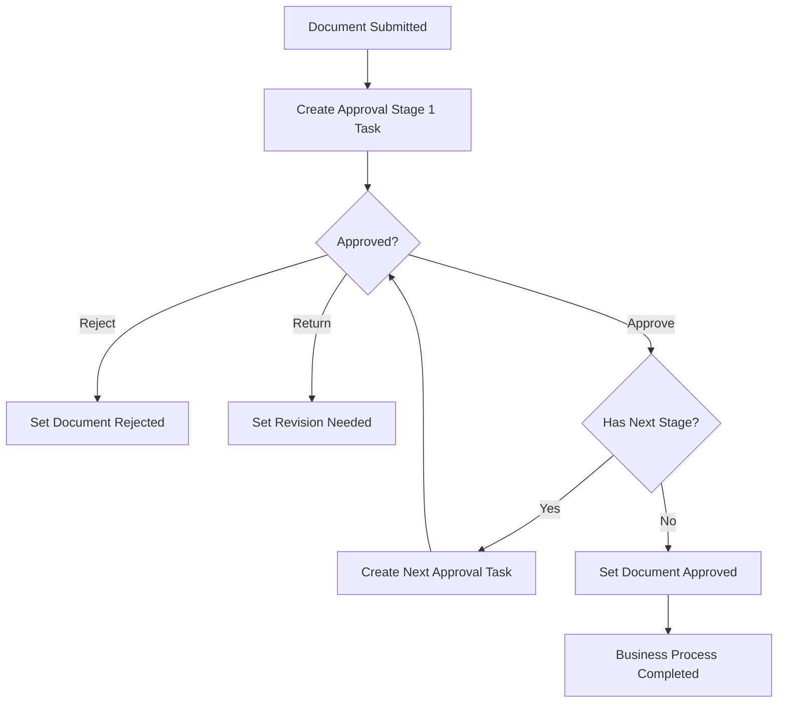

# Status Logic Engine untuk ETL, Alerting, Dashboard, dan Schedule

## Overview

Dokumen ini menjelaskan desain **status logic engine** yang dapat digunakan untuk memetakan status dari database client ke database internal agar siap dipakai untuk proses ETL, alerting, dashboard, schedule, dan audit trail.

Tujuan utama desain ini adalah agar perubahan status tidak di-hardcode di aplikasi, tetapi bisa diatur melalui konfigurasi administrator. Dengan begitu, alur status dapat disesuaikan untuk banyak jenis dokumen atau transaksi tanpa perlu mengubah kode inti.

## Sasaran Desain

Status logic ini dirancang agar mendukung kebutuhan berikut:

- perubahan status dari **before** ke **after**
- kembali ke status sebelumnya
- approval 1 tingkat
- approval lebih dari 1 tingkat
- reject dan return for revision
- SLA per role atau per tahap approval
- reminder saat approver harus bertindak
- escalation bila melewati SLA
- audit trail lengkap untuk ETL dan pelacakan historis
- siap dipakai untuk dashboard operasional dan manajerial

## Prinsip Arsitektur

Pisahkan 4 lapisan utama berikut:

1. **Master status**
   - daftar status standar
2. **Transition rules**
   - aturan status mana boleh pindah ke status mana
3. **Approval rules**
   - aturan siapa yang harus approve, berapa level, dan bagaimana urutannya
4. **Alerting dan audit**
   - pengingat, escalation, serta histori lengkap semua perubahan status

Prinsip penting:

- status dokumen tidak di-hardcode per modul
- approval dipisah dari status utama
- rollback, reject, resubmit, reminder, dan escalation dibuat configurable
- semua event perubahan status dicatat dalam tabel histori/event agar mudah di-ETL

## Konsep Inti

### 1. Status Dokumen

Contoh status dokumen generik:

- `DRAFT`
- `SUBMITTED`
- `WAITING_APPROVAL`
- `REVISION_NEEDED`
- `APPROVED`
- `REJECTED`
- `COMPLETED`
- `CANCELLED`

### 2. Aksi User atau Sistem

Contoh aksi:

- `SUBMIT`
- `APPROVE`
- `REJECT`
- `RETURN`
- `RESUBMIT`
- `CANCEL`
- `AUTO_ESCALATE`
- `AUTO_CLOSE`

### 3. Status Task Approval

Contoh status task approval:

- `WAITING`
- `APPROVED`
- `REJECTED`
- `RETURNED`
- `EXPIRED`
- `ESCALATED`
- `SKIPPED`

Pemisahan ini penting agar ETL, dashboard, dan audit tidak rancu antara status dokumen, aksi, dan status task approval.

## Diagram Status Logic Umum



## Diagram Approval Bertingkat



## Model Konfigurasi yang Disarankan

### A. Status Logic Definition

Satu status logic mewakili satu definisi alur untuk jenis dokumen tertentu.

Field utama:

- `status_logic_code`
- `status_logic_name`
- `document_type`
- `version`
- `active_flag`
- `effective_from`
- `effective_to`

Contoh:

- `PO_STANDARD`
- `INVOICE_PAYMENT_APPROVAL`
- `SERVICE_TICKET_APPROVAL`

### B. Status Logic Status Master

Field utama:

- `status_code`
- `status_name`
- `category`
- `is_initial`
- `is_final`
- `is_reject_state`
- `is_revision_state`
- `editable_flag`
- `display_order`
- `color_badge`

Contoh kategori:

- `OPEN`
- `APPROVAL`
- `REVISION`
- `FINAL`
- `TERMINAL`

### C. Transition Rule

Tabel ini menjadi inti before → after.

Field utama:

- `status_logic_id`
- `from_status`
- `action_code`
- `to_status`
- `allowed_actor_type`
- `allowed_role`
- `need_comment`
- `need_reason_code`
- `allow_manual`
- `allow_system`
- `allow_rollback`
- `rollback_mode`
- `rollback_target_status`
- `active_flag`

Contoh aturan:

| From Status | Action | To Status | Keterangan |
| --- | --- | --- | --- |
| `DRAFT` | `SUBMIT` | `SUBMITTED` | dokumen diajukan |
| `SUBMITTED` | `START_APPROVAL` | `WAITING_APPROVAL` | mulai proses approval |
| `WAITING_APPROVAL` | `APPROVE` | `WAITING_APPROVAL` atau `APPROVED` | lanjut level berikut atau final approve |
| `WAITING_APPROVAL` | `REJECT` | `REJECTED` | reject final atau sesuai policy |
| `WAITING_APPROVAL` | `RETURN` | `REVISION_NEEDED` | minta revisi |
| `REVISION_NEEDED` | `RESUBMIT` | `SUBMITTED` | submit ulang |

### D. Approval Stage

Gunakan tabel tahap approval agar approval 1 level maupun multi-level sama-sama bisa didukung.

Field utama:

- `status_logic_id`
- `stage_no`
- `stage_name`
- `approval_type`
- `sequence_mode`
- `min_approval_required`
- `all_must_approve`
- `on_reject_status`
- `on_return_status`
- `on_approve_next_stage`
- `final_approve_status`

Nilai yang umum:

- `approval_type`: `single`, `parallel`, `pool`, `hierarchy`
- `sequence_mode`: `sequential`, `parallel`

### E. Approval Resolver Rule

Tentukan siapa approver pada setiap stage.

Field utama:

- `stage_id`
- `resolver_type`
- `resolver_value`
- `based_on_field`
- `delegation_allowed`
- `substitute_role`
- `escalation_role`
- `condition_expression`
- `active_flag`

Contoh `resolver_type`:

- `fixed_user`
- `fixed_role`
- `requester_manager`
- `department_head`
- `branch_manager`
- `amount_matrix`
- `custom_service_rule`

### F. SLA dan Alert Rule

Field utama:

- `stage_id`
- `sla_minutes`
- `reminder_after_minutes`
- `reminder_repeat_every_minutes`
- `max_reminder_count`
- `escalate_after_minutes`
- `escalate_to_role`
- `business_hours_only`
- `holiday_calendar_id`
- `notification_channel`

## Desain Tabel Logis

### Tabel Master

- `status_logic_definitions`
- `status_logic_statuses`
- `status_logic_transitions`
- `status_logic_approval_stages`
- `status_logic_approval_rules`
- `status_logic_sla_rules`
- `status_logic_reason_codes`
- `status_logic_roles`

### Tabel Runtime

- `status_logic_instances`
- `status_logic_current_state`
- `status_logic_approval_tasks`
- `status_logic_alert_queue`
- `status_logic_escalation_log`
- `status_logic_history`

### Tabel ETL / Analytical

- `fact_status_logic_event`
- `fact_approval_task`
- `dim_status`
- `dim_role`
- `dim_document_type`
- `dim_status_logic`
- `dim_calendar`

## Struktur Tabel Runtime yang Direkomendasikan

### A. status_logic_instances

Satu baris per dokumen yang sedang berjalan di status logic.

Field utama:

- `instance_id`
- `status_logic_id`
- `document_type`
- `document_id`
- `document_no`
- `current_status`
- `current_stage_no`
- `requester_id`
- `requester_role`
- `submitted_at`
- `completed_at`
- `cancelled_at`
- `rejected_at`
- `last_action_at`
- `version_no`

### B. status_logic_approval_tasks

Satu baris per task approval.

Field utama:

- `task_id`
- `instance_id`
- `stage_no`
- `approver_user_id`
- `approver_role`
- `task_status`
- `assigned_at`
- `due_at`
- `acted_at`
- `action_result`
- `action_comment`
- `escalation_level`
- `delegated_from_user_id`
- `reminder_count`

### C. status_logic_history

Audit trail lengkap semua perubahan status dan approval.

Field utama:

- `history_id`
- `instance_id`
- `event_time`
- `from_status`
- `to_status`
- `action_code`
- `actor_user_id`
- `actor_role`
- `stage_no`
- `approval_task_id`
- `comment_text`
- `reason_code`
- `source_system`
- `source_event_id`
- `correlation_id`
- `payload_before`
- `payload_after`

Tabel ini adalah sumber utama untuk ETL, dashboard, audit, dan forensic tracing.

## Cara Menangani Kebutuhan Bisnis

### 1. Perubahan Status Before ke After

Gunakan `status_logic_transitions` untuk memvalidasi:

- `from_status` harus sama dengan status saat ini
- actor harus sesuai role atau tipe aktor yang diizinkan
- syarat approval harus terpenuhi
- histori harus ditulis sebelum dan sesudah update
- task atau alert berikutnya harus dibuat bila diperlukan

### 2. Kembali ke Status Sebelumnya

Jangan hanya mengandalkan status terakhir secara teknis. Buat kebijakan rollback yang eksplisit:

- `previous`: kembali ke status sebelumnya
- `specific`: kembali ke status tertentu, misalnya `DRAFT`
- `previous_editable`: kembali ke status terakhir yang dapat diedit

Field yang disarankan:

- `rollback_mode`
- `rollback_target_status`
- `rollback_reason_required`

### 3. Approval 1 Tingkat

Konfigurasi sederhana:

- `stage_no = 1`
- approver tunggal atau pool role
- jika approve → `APPROVED`
- jika reject → `REJECTED`
- jika return → `REVISION_NEEDED`

### 4. Approval Lebih dari 1 Tingkat

Gunakan `stage_no` berurutan.

Contoh:

- Stage 1: Supervisor
- Stage 2: Manager
- Stage 3: Director

Aturan:

- approve di stage n akan membuat task stage n+1
- approve di stage terakhir akan mengubah status dokumen menjadi `APPROVED`

### 5. Alert Saat Role Waktunya Approve

Saat task approval dibuat:

1. tentukan approver user atau role
2. hitung `due_at` dari SLA
3. buat event `approval_assigned`
4. kirim notifikasi ke inbox, email, WhatsApp, Telegram, atau channel lain

### 6. Alert Saat Waktunya Update Status Selanjutnya

Dua model yang bisa dipakai:

1. **manual next action reminder**
   - status sudah berubah tetapi tim berikutnya belum memproses
2. **automatic transition**
   - jika kondisi terpenuhi, sistem otomatis memindahkan ke status berikutnya

Contoh:

- `APPROVED` tetapi belum diproses 2 jam → alert ke role operasional
- `WAITING_APPROVAL` melewati SLA → escalation ke manager approver

### 7. Reject

Reject harus memiliki kebijakan yang jelas:

- reject terminal, status logic selesai
- reject tetapi boleh resubmit
- reject wajib memilih reason code

Field yang disarankan:

- `reject_is_terminal`
- `allow_resubmit_after_reject`
- `mandatory_reject_reason`

## Struktur Menu Administrator

Agar fitur ini mudah dikonfigurasi oleh admin bisnis, menu backend sebaiknya dibagi seperti berikut.

### 1. Status Logic Master

- Status Logic Code
- Status Logic Name
- Document Type
- Version
- Active atau Inactive
- Effective Date

### 2. Status Master

- Status Code
- Status Name
- Category
- Initial atau Final
- Editable atau Non-editable
- Color Badge

### 3. Transition Config

- From Status
- Action
- To Status
- Allowed Role
- Allowed Actor Type
- Need Comment
- Need Reason
- Rollback Allowed
- Rollback Mode

### 4. Approval Stage Config

- Stage No
- Stage Name
- Approval Type
- Sequential atau Parallel
- Min Approval Required
- Final Approve Status
- Return Status
- Reject Status

### 5. Approver Resolver Config

- Fixed Role atau Dynamic Role
- Based on Branch, Department, Amount, atau Requester Manager
- Delegation Allowed
- Escalation Role
- Substitute Rule

### 6. SLA dan Alert Config

- SLA Duration
- Reminder Schedule
- Escalation Duration
- Escalation Target
- Business Hour Calendar
- Notification Channel

### 7. Reason Code Config

- Reject Reasons
- Return Reasons
- Cancel Reasons
- Mandatory atau Optional

### 8. Audit Monitor

- Current Status Logic Instances
- Approval Queue
- Overdue Approvals
- Escalated Items
- Rejected Items
- Full History per Document

## Dashboard yang Disarankan

### Dashboard Operasional

- jumlah dokumen per status
- jumlah dokumen pending approval per role
- overdue approvals
- reminder sent count
- escalation count
- aging per status

### Dashboard Manajerial

- rata-rata approval lead time
- bottleneck per role
- reject rate per status logic
- return for revision rate
- SLA compliance rate
- top overdue approver groups

### Dashboard Audit

- siapa mengubah status apa
- dokumen yang rollback berulang
- approval yang delegated
- approval tanpa komentar padahal wajib

## Format Config yang Disarankan

Untuk runtime administrator, konfigurasi utama disimpan di tabel relasional.

Untuk versioning, deployment, atau migrasi antar environment, konfigurasi juga dapat diekspor dalam format JSON atau YAML.

Struktur minimum yang perlu ada:

- status logic metadata
- statuses
- transitions
- approval stages
- resolver rules
- SLA rules
- notification templates

Contoh struktur konseptual:

```yaml
status_logic: PO_STANDARD
statuses:
  - DRAFT
  - SUBMITTED
  - WAITING_APPROVAL
  - REVISION_NEEDED
  - APPROVED
  - REJECTED
transitions:
  - from: DRAFT
    action: SUBMIT
    to: SUBMITTED
  - from: WAITING_APPROVAL
    action: APPROVE
    to: APPROVED
approval_stages:
  - stage_no: 1
    resolver: SUPERVISOR
  - stage_no: 2
    resolver: MANAGER
sla:
  reminder_after_minutes: 60
  escalate_after_minutes: 240
alerts:
  - approval_assigned
  - reminder_due
  - overdue
  - escalated
```

## Aturan Bisnis Penting agar Lebih Advanced

### Approval Behavior

- apakah semua approver wajib approve atau cukup satu orang
- apakah parallel approval diperbolehkan
- apakah stage tertentu dapat di-skip
- apakah approver boleh diganti manual
- apakah creator boleh approve dokumennya sendiri
- apakah approval boleh didelegasikan

### Conditional Routing

- jika amount lebih besar dari batas tertentu, tambah stage director
- jika cabang tertentu, approver regional
- jika kategori high risk, wajib compliance approval
- jika vendor blacklist, alihkan ke review khusus

### Time Behavior

- SLA dihitung jam kerja atau kalender penuh
- SLA dipause saat status `REVISION_NEEDED`
- auto reject setelah batas waktu tertentu
- auto escalate bertingkat

### Data Integrity

- optimistic locking agar tidak terjadi double approval
- idempotent event untuk ETL
- correlation ID untuk trace lintas sistem
- immutable history log

### Security dan Audit

- alasan reject wajib
- alasan rollback wajib
- digital signature atau e-approval opsional
- simpan snapshot before dan after

## Pertanyaan Advance untuk Kustomisasi Lanjut

### Tentang Dokumen dan Proses

1. Jenis dokumen apa saja yang akan memakai status logic ini?
2. Apakah semua dokumen memakai pola status yang sama atau berbeda per modul?
3. Apakah ada status terminal permanen seperti `REJECTED` yang tidak boleh dibuka kembali?

### Tentang Approval

4. Apakah approval berbasis user, role, jabatan, atau struktur organisasi?
5. Apakah approver bisa lebih dari satu dalam satu level?
6. Apakah multi-approval berjalan sequential atau parallel?
7. Apakah cukup salah satu approver setuju, atau semua wajib setuju?
8. Apakah requester boleh menjadi approver untuk dokumennya sendiri?
9. Apakah perlu delegasi atau substitusi approver?

### Tentang Rollback dan Return

10. Kembali ke status sebelumnya berarti benar-benar ke state terakhir atau ke status editable tertentu?
11. Return dan reject dibedakan atau dianggap sama?
12. Jika dokumen direvisi dan disubmit ulang, approval mulai dari awal atau lanjut dari stage terakhir?

### Tentang SLA dan Alert

13. SLA dihitung 24/7 atau hanya jam kerja?
14. Apakah tiap role memiliki SLA yang berbeda?
15. Reminder dikirim sekali atau berkala?
16. Escalation naik ke atasan approver, role lain, atau group khusus?
17. Setelah escalation, approver lama masih boleh approve atau dikunci?

### Tentang Integrasi ETL

18. Sumber status client berasal dari tabel transaksi langsung atau event log?
19. Apakah yang disimpan hanya current status atau seluruh event history?
20. ETL yang diinginkan batch, near real-time, atau streaming?
21. Apakah source system punya event ID unik agar proses idempotent?

### Tentang Dashboard

22. KPI utama apa yang paling penting: aging, overdue, reject rate, approval lead time, atau bottleneck role?
23. Apakah dashboard dibedakan untuk admin, approver, manager, dan auditor?
24. Apakah perlu tampilan backlog per role dan workload per approver?

### Tentang Governance

25. Siapa yang boleh mengubah konfigurasi status logic?
26. Apakah konfigurasi harus versioned dan memiliki effective date?
27. Apakah instance lama tetap memakai versi status logic lama?
28. Apakah perlu sandbox atau UAT sebelum konfigurasi diaktifkan?

## Rekomendasi Roadmap Implementasi

### Versi 1

- status utama generik
- transition rule configurable
- approval sequential multi-level
- SLA, reminder, dan escalation
- audit trail immutable
- ETL dari tabel history atau event

### Versi 2

- conditional approver berdasarkan amount, branch, department, division
- parallel approval
- delegation dan substitution
- business calendar
- auto transition

### Versi 3

- expression-based rule engine
- simulation tester untuk status logic config
- dashboard bottleneck dan prediksi SLA risk
- policy versioning penuh

## Deskripsi Fitur untuk Administrator

Status Logic Engine adalah modul konfigurasi alur status dokumen atau transaksi yang mengatur perpindahan status, approval bertingkat, rollback, reject, SLA, reminder, escalation, dan audit trail. Administrator dapat menentukan status awal dan akhir, siapa aktor yang berhak menjalankan transisi, aturan approval per level, durasi SLA per role, serta notifikasi saat approval jatuh tempo atau proses melewati batas waktu. Semua aktivitas direkam dalam audit history agar dapat digunakan untuk alerting, dashboard operasional, analitik bottleneck, dan kebutuhan kepatuhan.

## Blueprint Proses Singkat

1. dokumen masuk
2. sistem membuat `status_logic_instance`
3. status awal ditetapkan
4. task approval dibuat sesuai stage
5. alert dikirim ke approver
6. jika approve maka sistem lanjut ke stage berikutnya
7. jika final approve maka status menjadi `APPROVED`
8. jika reject maka status menjadi `REJECTED`
9. jika return maka status menjadi `REVISION_NEEDED`
10. semua aksi ditulis ke `status_logic_history`
11. ETL membaca history, task, dan alert untuk kebutuhan alerting, dashboard, dan schedule

## Rekomendasi Next Step

Langkah paling efektif setelah dokumen ini adalah membuat satu contoh status logic nyata, misalnya untuk PO atau invoice, agar desain ini dapat diturunkan menjadi:

- daftar status final
- matriks transisi before dan after
- level approval nyata
- SLA per role
- event alert
- skema tabel final untuk ETL
