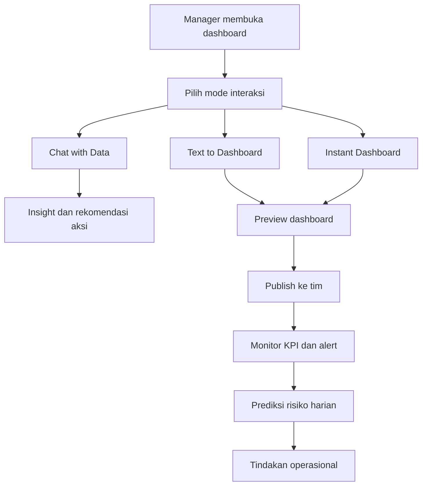
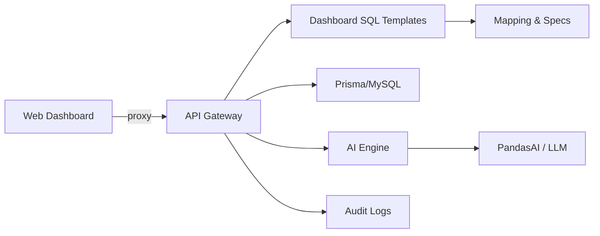

# Konsep Fitur Dashboard Manager Gudang berbasis PandasAI

## 1. Ringkasan Eksekutif

Dokumen ini mendefinisikan konsep produk bisnis untuk dashboard manager operasional gudang dengan mesin analitik berbasis PandasAI.

Fokus utama:
- Mempercepat keputusan harian berbasis data aktual.
- Mengubah dashboard pasif menjadi sistem rekomendasi aksi.
- Menyatukan analitik deskriptif, diagnostik, dan prediktif dalam satu alur kerja manager.

## 2. Tujuan Produk dan Value Proposition

### 2.1 Tujuan Produk
1. Mengurangi waktu dari pertanyaan ke keputusan.
2. Meningkatkan kualitas keputusan operasional lintas inbound, outbound, stok, dan tenaga kerja.
3. Menstandarkan satu sumber kebenaran untuk KPI operasional gudang.

### 2.2 Value Proposition
1. Manager bisa bertanya langsung ke data tanpa menunggu analis.
2. Dashboard operasional dapat dibuat otomatis dari data aktif dan instruksi teks.
3. Risiko operasional dapat diprediksi lebih awal agar tindakan korektif bisa diprioritaskan.

## 3. Persona, Kebutuhan, dan Pain Point

### 3.1 Persona Utama
Manager Operasional Gudang.

### 3.2 Kebutuhan Harian
- Memantau performa inbound, outbound, akurasi stok, SLA picking, dan produktivitas shift.
- Mengetahui akar masalah deviasi KPI.
- Menentukan aksi prioritas dengan dampak tertinggi.

### 3.3 Pain Point
- Data tersebar di WMS, ERP, spreadsheet, dan log scanner.
- Dashboard statis sulit menjawab pertanyaan ad hoc.
- Prediksi belum terhubung ke keputusan tindakan harian.

## 4. Ruang Lingkup Fitur

Fitur konsep yang wajib tercakup:
1. Chat with Data.
2. Pembuatan Dashboard Instan.
3. ETL cerdas.
4. Text-to-Dashboard.
5. Analisis Prediktif.
6. Fitur utama PandasAI.

## 5. Konsep Fitur Inti

### 5.1 Chat with Data

#### Tujuan
Memungkinkan manager menanyakan kondisi operasional dengan bahasa natural.

#### Contoh Pertanyaan
- SKU mana yang paling berisiko stockout dalam 7 hari
- Penyebab utama keterlambatan outbound minggu ini
- Shift mana dengan produktivitas terendah dan kenapa

#### Output Standar
- Ringkasan 1 paragraf.
- 3 sampai 5 insight utama.
- Rekomendasi aksi prioritas.
- Confidence score dan data freshness.

#### Nilai Bisnis
- Memotong waktu analisis ad hoc.
- Mempercepat eskalasi masalah prioritas tinggi.

### 5.2 Pembuatan Dashboard Instan

#### Tujuan
Membuat dashboard siap pakai dalam hitungan menit dari dataset aktif.

#### Alur Bisnis
1. Sistem mendeteksi dimensi, metrik, dan timestamp penting.
2. Sistem menghasilkan komposisi kartu KPI, tren, alert, dan daftar pengecualian.
3. Manager memilih template domain.
4. Dashboard dipublikasikan untuk tim operasional.

#### Contoh Hasil Dashboard
- Inbound Performance.
- Outbound SLA.
- Inventory Health.
- Workforce Productivity.

#### Nilai Bisnis
- Mengurangi ketergantungan pada pembuatan dashboard manual.
- Mempercepat onboarding domain analitik baru.

### 5.3 ETL Cerdas

#### Tujuan
Menyatukan data operasional lintas sumber ke model analitik yang konsisten.

#### Cakupan
- Extract data inbound, outbound, stock movement, master data, dan data shift.
- Transform normalisasi definisi metrik, timezone, kode lokasi, dan kode SKU.
- Load ke mart analitik untuk dashboard dan percakapan AI.

#### Fitur Pendukung
- Data quality checks otomatis.
- Data lineage per domain KPI.
- Incremental refresh dan fallback saat sumber data gagal.
- Freshness monitoring per domain data.

#### Nilai Bisnis
- Menurunkan konflik definisi angka antar tim.
- Meningkatkan kepercayaan terhadap insight AI.

### 5.4 Text-to-Dashboard

#### Tujuan
Manager menulis kebutuhan dashboard dalam teks dan sistem menyusun dashboard otomatis.

#### Contoh Prompt
- Buat dashboard SLA outbound per jam dengan top 10 penyebab delay
- Buat dashboard stok kritis per gudang dan prediksi habis 7 hari

#### Proses Bisnis
1. Prompt diparse menjadi intent dashboard.
2. Sistem memetakan intent ke metrik, dimensi, filter, dan visual.
3. Sistem menampilkan pratinjau beserta rekomendasi konfigurasi.
4. Manager menyetujui dan menyimpan dashboard.

#### Nilai Bisnis
- Mempercepat eksperimen kebutuhan laporan baru.
- Meningkatkan kemandirian user non teknis.

### 5.5 Analisis Prediktif

#### Tujuan
Memberi peringatan dini agar manager dapat mencegah gangguan operasional.

#### Use Case Prioritas
- Prediksi stockout risk per SKU per gudang.
- Prediksi keterlambatan outbound berdasarkan pola order, shift, dan kapasitas.
- Prediksi bottleneck picking saat volume naik.

#### Output Bisnis
- Daftar risiko terurut berdasarkan potensi dampak.
- Skenario tindakan yang direkomendasikan.
- Penjelasan faktor pendorong utama.

#### Nilai Bisnis
- Menggeser pola kerja dari reaktif ke proaktif.
- Mengurangi kejadian SLA breach dan kehilangan penjualan akibat stok kosong.

### 5.6 Fitur Utama PandasAI

Fitur PandasAI yang diposisikan sebagai mesin inti:
1. Natural language query ke DataFrame.
2. Auto-generated code untuk analisis yang dapat diaudit.
3. Explainability jawaban analitik.
4. Visual output cepat untuk eksplorasi insight.
5. Integrasi dengan sumber data tabular untuk workflow operasional.

Nilai produk:
- Menjembatani user bisnis dengan kompleksitas analitik.
- Menjaga transparansi jawaban AI untuk kebutuhan audit operasional.

## 6. User Flow End-to-End

## 7. KPI Produk dan KPI Operasional

### 7.1 KPI Produk
1. Adoption rate manager aktif mingguan.
2. Rasio pertanyaan Chat with Data yang menghasilkan aksi.
3. Waktu rata rata dari pertanyaan ke keputusan.
4. Rasio dashboard yang dibuat via instant dan text-to-dashboard.

### 7.2 KPI Operasional Gudang
1. Outbound SLA attainment.
2. Inbound cycle time.
3. Inventory accuracy.
4. Stockout rate.
5. Picking productivity per shift.
6. Order delay rate.

### 7.3 KPI Kualitas Insight AI
1. Confidence score distribusi per insight.
2. Persentase insight dengan freshness sesuai SLA data.
3. Rasio rekomendasi yang diterima manager.

## 8. Prioritas Fitur per Fase

### Fase 1 - Fondasi dan Nilai Cepat
1. ETL domain outbound dan inventory.
2. Dashboard instan untuk Inbound, Outbound, Inventory.
3. Chat with Data untuk pertanyaan deskriptif dan diagnostik.
4. Tampilkan confidence score dan data freshness pada setiap insight.

### Fase 2 - Skalasi Self Service
1. Text-to-Dashboard dengan template domain gudang.
2. Library prompt bisnis yang terstandar.
3. Drill down dari KPI ke transaksi detail.
4. Workflow publikasi dashboard ke unit operasional.

### Fase 3 - Prediktif dan Optimasi
1. Prediksi stockout dan keterlambatan outbound.
2. Prioritized risk list berbasis dampak bisnis.
3. Rekomendasi aksi semi otomatis per skenario risiko.
4. Evaluasi akurasi prediksi dan peningkatan model berkelanjutan.

## 9. Aturan Bisnis dan Governance

1. Semua insight wajib menyertakan data freshness.
2. Semua rekomendasi wajib punya tautan ke data sumber.
3. Definisi metrik harus distandarkan pada semantic layer.
4. Akses data mengikuti role manager dan kebijakan keamanan.
5. Audit trail disimpan untuk query, output, dan versi model.

## 10. Arsitektur Aplikasi (Mapping ke Apps)

Bagian ini memetakan konsep fitur ke aplikasi yang sudah ada di repository.

### 10.1 Mapping Komponen ke Aplikasi

| Komponen | Aplikasi | Peran | Status Saat Ini |
| --- | --- | --- | --- |
| Web UI Dashboard Manager | `apps/web-dashboard` | Frontend dashboard, konsumsi API, dan UI interaksi | Sudah ada, memiliki `app/api/dashboard/*` proxy ke gateway |
| API Gateway | `apps/api-gateway` | Orkestrasi API dashboard, query data, audit trail | Sudah ada modul dashboard dan endpoint `GET /dashboard/*` |
| AI Engine (PandasAI) | `apps/ai-engine` | Layanan AI untuk Chat with Data, Text-to-Dashboard, dan insight | Belum ada implementasi eksplisit PandasAI (repo baru berisi konfigurasi) |
| Mapping Data & ERD | `apps/myerpplus-db-mapping` | Mapping schema, kandidat KPI, template SQL dashboard | Sudah ada pipeline mapping & SQL templates |
| Landing Page | `apps/landing-page` | Informasi produk/marketing | Tidak terkait langsung ke fitur operasional |

### 10.2 Alur Data & API Utama

Rincian alur:
1. `apps/web-dashboard` memanggil `app/api/dashboard/*` sebagai proxy.
2. `apps/api-gateway` menyediakan endpoint domain dashboard (`/dashboard/:domain/*`).
3. Query dashboard dijalankan melalui template SQL dari mapping di `apps/myerpplus-db-mapping`.
4. Fitur Chat/Insight seharusnya diproses oleh `apps/ai-engine`, namun integrasi masih belum tersedia.

### 10.3 Lokasi Implementasi Fitur

- **Chat with Data**
  - UI: `apps/web-dashboard` (chat panel, hasil ringkasan, insight cards).
  - API: endpoint baru di `apps/api-gateway` untuk mengirim pertanyaan ke `apps/ai-engine`.
  - Engine: `apps/ai-engine` memanggil PandasAI untuk query DataFrame dan penjelasan.

- **Pembuatan Dashboard Instan**
  - UI: wizard di `apps/web-dashboard` untuk memilih dataset dan template.
  - API: `apps/api-gateway` mengembalikan metadata domain + KPI candidate.
  - Data: `apps/myerpplus-db-mapping` sebagai sumber kandidat KPI, dimensi, dan template SQL.

- **ETL Cerdas**
  - Belum ada layanan ETL khusus; perlu penambahan job scheduler/worker.
  - Output ETL perlu masuk ke schema analitik agar query dashboard konsisten.

- **Text-to-Dashboard**
  - Engine: `apps/ai-engine` (intent parsing dan mapping metrik/visual).
  - API: endpoint di `apps/api-gateway` untuk menyimpan konfigurasi dashboard.

- **Analisis Prediktif**
  - Engine: `apps/ai-engine` (model prediksi + scoring).
  - API: `apps/api-gateway` menampilkan risk list dan rekomendasi aksi.

### 10.4 Integrasi yang Perlu Ditambahkan di API Gateway

Rekomendasi endpoint tambahan:
- `POST /dashboard/ai/chat` → Chat with Data.
- `POST /dashboard/ai/text-to-dashboard` → parsing prompt menjadi konfigurasi dashboard.
- `GET /dashboard/ai/predictive` → risk list + skor dampak.
- `GET /dashboard/ai/insight-history` → audit trail hasil AI.

## 11. Gap dan Kebutuhan Tambahan

Berikut gap terhadap arsitektur yang dibutuhkan untuk fitur PandasAI dan dashboard manager.

### 11.1 Gap Aplikasi
1. **AI Engine masih kosong** → perlu modul PandasAI, prompt templates, dan konektor data.
2. **ETL belum tersedia** → perlu scheduler (misalnya Celery/cron) dan pipeline ke schema analitik.
3. **Semantic layer belum ada** → definisi KPI dan glossary belum terpusat sebagai service.
4. **Text-to-Dashboard belum ada** → perlu storage konfigurasi dashboard & metadata UI.
5. **Predictive model belum ada** → pipeline pelatihan dan scoring belum terdefinisi.

### 11.2 Gap Data dan Infrastruktur
1. **Data mart analitik** belum jelas lokasi schema analitiknya.
2. **Feature store / cache** untuk insight AI belum ada.
3. **Audit trail AI** belum ada penyimpanan khusus (perlu tabel/collection).
4. **Monitoring data freshness** belum memiliki SLA dan metrik otomatis.

### 11.3 Gap UX Produk
1. Belum ada modul UI chat di `apps/web-dashboard`.
2. Belum ada wizard dashboard instan dan text-to-dashboard.
3. Belum ada panel risk list prediktif.

## 12. Risiko Produk dan Mitigasi

1. Risiko kepercayaan rendah pada insight AI.
   - Mitigasi: tampilkan explainability, confidence score, dan data lineage.
2. Risiko konflik definisi KPI antar unit.
   - Mitigasi: glossary KPI dan semantic model tunggal.
3. Risiko adopsi rendah akibat UX kompleks.
   - Mitigasi: fokus decision-first layout dan rekomendasi aksi yang ringkas.

## 13. Kriteria Keberhasilan Konsep

Konsep dianggap berhasil bila:
1. Manager dapat menjawab pertanyaan ad hoc tanpa bergantung penuh pada analis.
2. Dashboard baru dapat dibuat dan dipakai cepat oleh tim operasional.
3. Insight prediktif menghasilkan tindakan pencegahan yang nyata.
4. KPI operasional utama menunjukkan perbaikan yang konsisten.

## 14. Ringkasan

Konsep ini menempatkan PandasAI sebagai penggerak interaksi natural language dan analitik explainable, sementara dashboard manager difokuskan pada alur keputusan harian.

Dengan kombinasi Chat with Data, Pembuatan Dashboard Instan, ETL cerdas, Text-to-Dashboard, Analisis Prediktif, dan fitur inti PandasAI, produk diarahkan untuk menghasilkan insight yang dapat langsung ditindaklanjuti dan berdampak pada performa operasional gudang.
