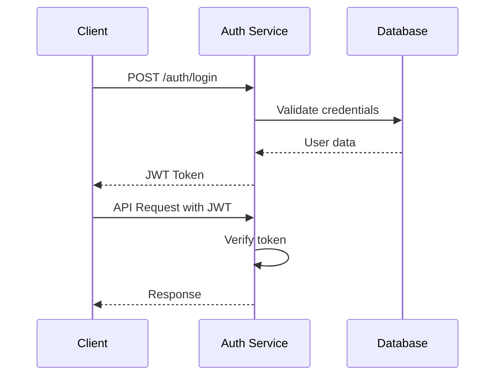

# Authentication API

Sentient Factory uses JWT-based authentication for securing API endpoints.

## Authentication Flow



## Base URL

All API endpoints are relative to:

```
https://api.sentientfactory.com/v1
```

For local development:

```
http://localhost:3103/v1
```

## Authentication Methods

### 1. JWT Authentication

**Note on Cookies:** For web applications (like the Admin Dashboard), the JWT access token and refresh token are set in **HttpOnly, Secure cookies** upon successful login. The response body may or may not contain the token depending on the client type configuration.

#### Login

```http
POST /auth/login
Content-Type: application/json

{
  "email": "user@example.com",
  "password": "your_password"
}
```

**Response (Web Client):**

```json
{
  "success": true,
  "data": {
    "user": {
      "id": "user_123",
      "email": "user@example.com",
      "name": "John Doe",
      "role": "admin",
      "createdAt": "2024-01-01T00:00:00Z"
    }
  },
  "message": "Login successful"
}
```

_Response Headers:_
`Set-Cookie: access_token=eyJ...; HttpOnly; Secure; Path=/`

**Response (API/Mobile Client):**

```json
{
  "success": true,
  "data": {
    "token": "eyJhbGciOiJIUzI1NiIsInR5cCI6IkpXVCJ9...",
    "user": {
      "id": "user_123",
      "email": "user@example.com",
      "name": "John Doe",
      "role": "admin",
      "createdAt": "2024-01-01T00:00:00Z"
    }
  }
}
```

#### Refresh Token

```http
POST /auth/refresh
Authorization: Bearer {refresh_token}
```

**Response:**

```json
{
  "success": true,
  "data": {
    "token": "new_access_token",
    "refreshToken": "new_refresh_token"
  }
}
```

#### Logout

```http
POST /auth/logout
Authorization: Bearer {access_token}
```

**Response:**

```json
{
  "success": true,
  "message": "Logged out successfully"
}
```

### 2. API Key Authentication

For machine-to-machine communication, you can use API keys:

```http
GET /api/endpoint
X-API-Key: your_api_key_here
```

## User Management

### Register User

```http
POST /auth/register
Content-Type: application/json

{
  "email": "newuser@example.com",
  "password": "secure_password",
  "name": "New User",
  "company": "Example Corp"
}
```

**Response:**

```json
{
  "success": true,
  "data": {
    "id": "user_456",
    "email": "newuser@example.com",
    "name": "New User",
    "role": "user",
    "createdAt": "2024-01-01T00:00:00Z"
  }
}
```

### Get Current User

```http
GET /auth/me
Authorization: Bearer {access_token}
```

**Response:**

```json
{
  "success": true,
  "data": {
    "id": "user_123",
    "email": "user@example.com",
    "name": "John Doe",
    "role": "admin",
    "permissions": ["read", "write", "admin"],
    "createdAt": "2024-01-01T00:00:00Z",
    "updatedAt": "2024-01-01T00:00:00Z"
  }
}
```

### Update User Profile

```http
PUT /auth/profile
Authorization: Bearer {access_token}
Content-Type: application/json

{
  "name": "Updated Name",
  "company": "Updated Company"
}
```

**Response:**

```json
{
  "success": true,
  "data": {
    "id": "user_123",
    "email": "user@example.com",
    "name": "Updated Name",
    "company": "Updated Company",
    "updatedAt": "2024-01-02T00:00:00Z"
  }
}
```

### Change Password

```http
PUT /auth/password
Authorization: Bearer {access_token}
Content-Type: application/json

{
  "currentPassword": "old_password",
  "newPassword": "new_secure_password"
}
```

**Response:**

```json
{
  "success": true,
  "message": "Password updated successfully"
}
```

## Password Reset

### Request Password Reset

```http
POST /auth/password/reset
Content-Type: application/json

{
  "email": "user@example.com"
}
```

**Response:**

```json
{
  "success": true,
  "message": "Password reset email sent"
}
```

### Reset Password with Token

```http
POST /auth/password/reset/confirm
Content-Type: application/json

{
  "token": "reset_token_from_email",
  "newPassword": "new_secure_password"
}
```

**Response:**

```json
{
  "success": true,
  "message": "Password reset successful"
}
```

## OAuth2 Integration

### Google OAuth2

```http
GET /auth/google
```

Redirects to Google OAuth2 consent screen.

### GitHub OAuth2

```http
GET /auth/github
```

Redirects to GitHub OAuth2 consent screen.

### OAuth2 Callback

```http
GET /auth/{provider}/callback?code={authorization_code}
```

**Response:**

```json
{
  "success": true,
  "data": {
    "token": "jwt_token",
    "user": {
      "id": "user_123",
      "email": "user@example.com",
      "name": "John Doe"
    }
  }
}
```

## Role-Based Access Control

### Available Roles

- `super_admin`: Full system access
- `admin`: Organization-level administration
- `manager`: Team and project management
- `operator`: Machine operation and monitoring
- `viewer`: Read-only access

### Check Permissions

```http
GET /auth/permissions
Authorization: Bearer {access_token}
```

**Response:**

```json
{
  "success": true,
  "data": {
    "role": "admin",
    "permissions": [
      "users:read",
      "users:write",
      "machines:read",
      "machines:write",
      "reports:read"
    ]
  }
}
```

## Rate Limiting

Authentication endpoints have the following rate limits:

- Login attempts: 5 per minute per IP
- Password reset requests: 3 per hour per email
- Token refresh: 10 per minute per token

## Error Responses

### Invalid Credentials

```json
{
  "success": false,
  "error": {
    "code": "INVALID_CREDENTIALS",
    "message": "Invalid email or password"
  }
}
```

### Token Expired

```json
{
  "success": false,
  "error": {
    "code": "TOKEN_EXPIRED",
    "message": "Access token has expired"
  }
}
```

### Insufficient Permissions

```json
{
  "success": false,
  "error": {
    "code": "INSUFFICIENT_PERMISSIONS",
    "message": "You don't have permission to access this resource"
  }
}
```

## Security Headers

All authentication responses include security headers:

- `Strict-Transport-Security`: max-age=31536000; includeSubDomains
- `X-Content-Type-Options`: nosniff
- `X-Frame-Options`: DENY
- `X-XSS-Protection`: 1; mode=block

## Best Practices

1. **Store tokens securely**: Use secure storage (HTTP-only cookies, secure storage)
2. **Implement token refresh**: Automatically refresh tokens before they expire
3. **Handle errors gracefully**: Implement proper error handling for auth failures
4. **Use HTTPS**: Always use HTTPS in production
5. **Validate inputs**: Validate all user inputs on both client and server
6. **Implement logging**: Log authentication attempts for security monitoring
7. **Regular token rotation**: Implement periodic token rotation policies

## SDK Examples

### JavaScript/Node.js

```javascript
import { SentientFactoryClient } from "@sentientfactory/sdk";

const client = new SentientFactoryClient({
  baseURL: "https://api.sentientfactory.com/v1",
  apiKey: "your_api_key",
});

// Login
const auth = await client.auth.login({
  email: "user@example.com",
  password: "password",
});

// Make authenticated request
const user = await client.auth.getCurrentUser();
```

### Python

```python
from sentientfactory import Client

client = Client(
    base_url="https://api.sentientfactory.com/v1",
    api_key="your_api_key"
)

# Login
auth = client.auth.login(
    email="user@example.com",
    password="password"
)

# Make authenticated request
user = client.auth.get_current_user()
```

### cURL Examples

```bash
# Login
curl -X POST https://api.sentientfactory.com/v1/auth/login \
  -H "Content-Type: application/json" \
  -d '{"email":"user@example.com","password":"password"}'

# Get current user
curl -X GET https://api.sentientfactory.com/v1/auth/me \
  -H "Authorization: Bearer YOUR_TOKEN"
```
