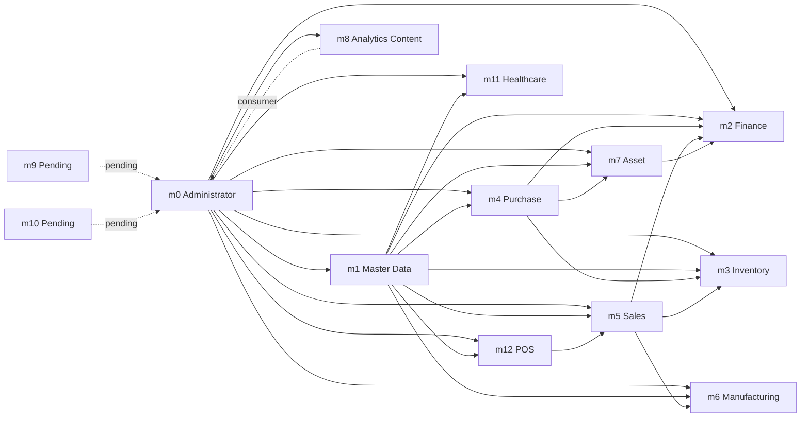

# OBT Concept for MyERPPlus M0-M12

This page explains the **OBT** concept for MyERPPlus from `m0` to `m12`.

In this context, **OBT does not have to mean one very large physical table**. What is more useful is:

- one clear **semantic business grain**
- one main **fact** per analytical topic
- reusable reference dimensions
- history and cross-document flow only when they are actually needed

So the target is not always `one big physical table`, but rather:

- a **virtual semantic OBT**
- a **process-specific view**
- a **use-case-specific derived dataset**
- or an **analytics layer** that joins header, detail, reference, and status in a controlled way

## Core Principles

OBT design for MyERPPlus should follow these principles:

1. **Define the grain first, then join**
   Decide first what one row represents: document header, item detail, payment, allocation, or daily snapshot.
2. **Do not mix all history into the main fact**
   History is safer as a separate audit layer, not as the default analytical fact.
3. **Master data is not the fact**
   `m1` is usually used as conformed dimensions, not as the main transaction fact.
4. **Document flow matters more than one giant table**
   For modules such as `m4`, `m5`, and `m6`, a good OBT usually comes from document flow, not from a single source table.
5. **Polymorphic relations must be explicit**
   If one field can point to multiple document types, the semantic mapping must state that explicitly.

## OBT Naming Convention

To keep the semantic layer stable and easy for AI agents to read:

- use **canonical names based on business domain**, not source module names
- recommended example: `obt_sales_line_flow`
- not recommended as the main semantic name: `obt_m5_sales_document_line_flow`
- keep the source module separate, for example `Source module: m5`

Practical rules:

- `obt_*` names should describe business domain and business grain
- module prefixes such as `m5`, `m4`, or `m12` do not need to appear in the canonical name
- module prefixes are only acceptable for internal implementation artifacts when two physical tables truly need to be distinguished

## Semantic OBT Patterns

In general, semantic OBTs in MyERPPlus can be grouped into four forms:

- **Document Header OBT**
  Suitable for status tracking, approval tracking, outstanding tracking, and aging.
- **Document Detail OBT**
  Suitable for quantity analysis, item movement, line profitability, and cross-document progress tracing.
- **Payment / Allocation OBT**
  Suitable for settlement flow, advance usage, voucher usage, and inter-document allocation.
- **Snapshot / Content OBT**
  Suitable for dashboard KPIs, content analytics, or processed data that is not purely transactional.

## Semantic Source Of Truth

This page is meant to be derived from the semantic artifacts under:

- `apps/myerpplus-db-mapping/db/semantic-schema.json`
- `apps/myerpplus-db-mapping/db/semantic-cross-module-lineage.md`
- `apps/myerpplus-db-mapping/db/m0 - administrator/semantic-schema-m0-summary.md`
- `apps/myerpplus-db-mapping/db/m1-master data/semantic-schema-m1-summary.md`
- `apps/myerpplus-db-mapping/db/m2-finance/semantic-schema-m2-summary.md`
- `apps/myerpplus-db-mapping/db/m3-inventory/semantic-schema-m3-summary.md`
- `apps/myerpplus-db-mapping/db/m4-purchasing/semantic-schema-m4-summary.md`
- `apps/myerpplus-db-mapping/db/m5-sales/semantic-schema-m5-summary.md`
- `apps/myerpplus-db-mapping/db/m6-manufacturing/semantic-schema-m6-summary.md`
- `apps/myerpplus-db-mapping/db/m7-procurement advanced/semantic-schema-m7-summary.md`
- `apps/myerpplus-db-mapping/db/m11-healthcare/semantic-schema-m11-summary.md`
- `apps/myerpplus-db-mapping/db/m12-pos/semantic-schema-m12-summary.md`

The most important fields to respect when building OBTs are:

- semantic table groups
- join hints
- detail-level relation keys
- cross-module relation keys
- polymorphic relationships

If a proposed OBT ignores those artifacts, it is no longer a semantic OBT; it is only a guessed denormalized table.

## How To Turn Semantic Schema Into A Physical OBT

If the implementation target is a physical "one big table", the safest translation from the semantic layer is:

1. choose **one business grain** first
2. choose the **detail or header anchor** that the semantic summary uses most clearly
3. lift to the parent header only after the anchor row is known
4. enrich labels from `m1` and system status or user metadata from `m0`
5. keep allocation, payment, voucher, and history tables separate unless they are the actual grain
6. only materialize cross-module joins when `semantic-cross-module-lineage.md` shows a stable path

In practice, this means:

- one physical OBT per process is usually correct
- one physical OBT for all modules from `m0` to `m12` is usually too ambiguous
- "one big table" should normally mean **one big table per semantic process**, not one merged ERP super-table

## Semantic-To-Physical OBT Matrix

The table below is the practical bridge from the semantic artifacts to buildable OBTs.

| Canonical OBT | Semantic anchor grain | Main source tables from semantic schema | Safe enrichment | Keep separate by default |
| --- | --- | --- | --- | --- |
| `obt_admin_access` | one row per user-role-menu-access event or activity event | `m0_user`, `m0_user_role`, `m0_role`, `m0_role_menu`, `m0_menu`, `m0_userlog` | `m0_module`, `m0_status` | settings, backup, numbering, translation, queue internals unless explicitly needed |
| `dim_item` | one row per item master | `m1_item` | `m1_item_category`, `m1_item_type`, `m1_unit`, `m1_class_product`, `m1_warehouse` | item price history and transaction-side facts |
| `dim_contact` | one row per contact master | `m1_contact` | category, terms, salesman, branch, location | transactional AR/AP or sales facts |
| `obt_finance_document` | one row per finance document header or finance document line | `m2_cr`, `m2_cr_detail`, `m2_cd`, `m2_cd_detail`, `m2_bd`, `m2_bd_detail`, `m2_rm`, `m2_rm_detail`, `m2_sm`, `m2_sm_detail`, `m2_cb`, `m2_cb_detail`, `m2_rg`, `m2_rg_detail`, `m2_sg`, `m2_sg_detail`, `m2_gj`, `m2_gj_detail`, `m2_aj`, `m2_aj_detail`, `m2_jm`, `m2_jm_detail` | `m1_contact`, `m1_coa`, `m1_branch`, `m1_location`, `m1_currency` | `_pay`, `m2_transaction_journal`, clearing tables, history tables unless the use case is allocation or posting |
| `obt_finance_allocation` | one row per finance allocation or payment distribution | `m2_rm_pay`, `m2_sm_pay`, `m2_cb_pay`, plus related header tables | `m1_contact`, `m1_coa`, `m1_currency` | generic document-line OBT and posted journal layer |
| `obt_inventory_movement_line` | one row per stock movement line | `m3_mr_detail`, `m3_ts_detail`, `m3_rs_detail`, `m3_sp_detail`, `m3_sa_detail` with parent headers | `m1_item`, `m1_warehouse`, `m1_location`, `m0_status` | history tables and unrelated setup tables |
| `obt_purchase_line_flow` | one row per purchasing line traced across lifecycle documents | `m4_pr_detail`, `m4_rq_detail`, `m4_bs_detail`, `m4_po_detail`, `m4_grn_detail`, `m4_ri_detail`, `m4_dnr_detail`, `m4_prt_detail` | `m1_contact`, `m1_item`, `m1_warehouse`, `m1_terms`, `m1_branch`, `m1_location` | `m4_vpp_detail`, `m4_vp_detail`, `m4_ap_pay`, invoice exchange, history unless payment is the target grain |
| `obt_purchase_payment` | one row per payable target or vendor payment allocation | `m4_ap`, `m4_ap_pay`, `m4_vpp_detail`, `m4_vp_detail`, `m4_ri` | `m1_contact`, `m1_currency`, `m1_coa` | procurement line-flow OBT |
| `obt_sales_line_flow` | one row per sales line traced across quotation, order, delivery, invoice, and return | `m5_sq_detail`, `m5_so_detail`, `m5_pi_detail`, `m5_pl_detail`, `m5_do_detail`, `m5_dr_detail`, `m5_si_detail`, `m5_rnr_detail`, `m5_sr_detail` | `m1_contact`, `m1_item`, `m1_warehouse`, `m1_terms`, `m1_branch`, `m1_location` | `m5_ic_detail`, `m5_pv_detail`, `m5_as_pay`, `m5_rp_pay`, history unless settlement is the target grain |
| `obt_sales_receivable` | one row per invoice, receivable target, or collection allocation | `m5_si`, `m5_ic_detail`, `m5_pv_detail`, `m5_as`, `m5_as_pay`, `m5_rp`, `m5_rp_pay` | `m1_contact`, `m1_currency`, `m1_coa` | order-to-ship line flow and history layer |
| `obt_manufacturing_execution` | one row per work-order material line, output line, or activity line | `m6_wo_in`, `m6_wo_out`, `m6_wo_activity`, `m6_wo_route_card`, plus `m6_wo`; optionally `m6_mrs_out`, `m6_mrn_out`, `m6_pd_out`, `m6_pdr_out` based on the use case | `m1_item`, `m1_warehouse`, `m1_location` | BOM history, header-only reference joins, inactive history tables |
| `obt_asset_lifecycle` | one row per asset event | `m7_asset`, `m7_ar_detail`, `m7_aq_detail`, `m7_ao_detail`, `m7_ae_detail`, `m7_at_detail`, `m7_ag_detail`, `m7_da_detail` | `m1_coa`, `m1_branch`, `m1_location`, `m1_contact` | history tables and payment rows unless mutation/payment is the target grain |
| `obt_metric_snapshot` | one row per metric, chart, content, or indicator snapshot | active `m8` content and metric tables | `m0_user`, `m0_module` only when needed for ownership metadata | operational transaction flows from `m2` to `m7` |
| `obt_patient_visit_billing` | one row per patient visit line or billing line | `m_11_kj`, `m_11_ak_detail`, `m_11_lu_detail`, `m_11_lb_detail`, `m_11_ro_detail`, `m_11_kw_detail` with visit-linked headers | `m1_contact`, `m1_item`, `m0_status` | mixing all clinical, lab, prescription, and payment artifacts into one row without a visit anchor |
| `obt_pos_transaction_line` | one row per POS cashier transaction item | `m_12_st_detail`, `m_12_st` | `m1_contact`, `m1_item`, POS area and category masters | promo-rule masters, voucher-rule masters, and history unless promo/voucher is the actual grain |
| `obt_pos_promo_application` | one row per promo or voucher application line | `m_12_ai_detail`, `m_12_ai_additional`, `m_12_bi_detail`, `m_12_bi_bonus`, `m_12_ppv_detail`, `m_12_ppv_pay`, `m_12_pos_voucher_out` | `m1_contact`, `m1_item`, `m5_si` only for formal voucher-to-invoice linkage | cashier sales line OBT and setup masters not required for the promotion event |

This matrix should be read together with:

- detail-level relation keys in each module summary
- cross-module boundaries in `semantic-cross-module-lineage.md`
- polymorphic rules in `m4` and `m5` payment or exchange flows

For physical implementation guidance, see:

- [Semantic To Physical OBT Mapping](./semantic-to-physical-obt-mapping.md)

## OBT Map By Module

| Module | Semantic domain | Recommended OBT grain | Main fact | Important dimensions | Notes |
| --- | --- | --- | --- | --- | --- |
| `m0` | Administrator | user-role-menu, queue log, config item | access, configuration, queue, audit | user, menu, module, status | should not be forced into one single table |
| `m1` | Master Data | item, contact, branch, location | master reference | branch, location, item, contact | best treated as conformed dimensions |
| `m2` | Finance | document header, journal detail, payment allocation | cash/bank, AR/AP, adjustment, voucher | contact, COA, currency, status | history and payment layers should stay separate |
| `m3` | Inventory | detail per stock movement | stock movement, receipt, issue, transfer | item, warehouse, location, batch | detail grain is more important than header |
| `m4` | Purchase | procurement lifecycle detail | PR, RFQ, PO, GRN, RI, AP | vendor, item, warehouse, status | cross-document and polymorphic relations must be explicit |
| `m5` | Sales | sales and receivable lifecycle detail | SQ, SO, DO, DR, SI, SR, IC, PV | customer, item, warehouse, term | OBT is usually more effective by flow than by mega-table |
| `m6` | Manufacturing | production execution detail | WO, BOM, material issue, receipt | item, work center, route, warehouse | good for tracing consumption versus output |
| `m7` | Asset / Procurement Advanced | asset lifecycle | registration, mutation, depreciation, disposal | asset, location, category, status | active sources are closer to fixed asset than generic procurement |
| `m8` | Analytics Content | content snapshot or KPI definition | metric, chart, indicator | content group, metric source | closer to a semantic mart than to a transaction domain |
| `m9` | Pending | not final yet | not final yet | not final yet | active source is not available yet |
| `m10` | Pending | not final yet | not final yet | not final yet | active source is not available yet |
| `m11` | Healthcare | visit-centric detail | visit, billing, service, prescription | patient, doctor, service, status | visit or billing line is safer than one giant clinical table |
| `m12` | POS | cashier transaction line | POS transaction, promo, voucher, loyalty | item, POS category, area, customer | promo master and live transaction should stay separate |

## Cross-Module Relations M0-M12

From the active queries and reports that have been scanned, MyERPPlus cross-module relations are not symmetric. Some modules are true **reference backbones**, some are **transaction owners**, and some are mainly **downstream consumers**.

### Main Backbone

- `m0 -> all active modules`
  - Used for `m0_nomor`, `m0_user`, `m0_status`, `m0_status_progress`, audit logs, and queues
  - In practice, `m0` is the governance and application layer, not the primary business fact layer
- `m1 -> almost all transaction modules`
  - Provides branch, location, contact, item, warehouse, COA, division, project, and other references
  - In the semantic layer, `m1` is the main conformed dimension backbone

### High-Level Relation Map

| Module | Directly connected to | Dominant relation type |
| --- | --- | --- |
| `m0` | `m1`, `m2`, `m3`, `m4`, `m5`, `m6`, `m7`, `m8`, `m11`, `m12` | numbering, status, user, audit, application services |
| `m1` | `m0`, `m3`, `m4`, `m5`, `m12` | shared master reference and cross-domain lookup |
| `m2` | `m0`, `m1`, `m4`, `m5`, `m7` | finance posting, settlement, AP/AR/asset reference |
| `m3` | `m0`, `m1`, `m4`, `m5`, `m7` | stock movement, receipt/issue, warehouse and asset relations |
| `m4` | `m0`, `m1`, `m2`, `m3`, `m5`, `m7` | procurement flow, goods receipt, vendor payable, asset intake |
| `m5` | `m0`, `m1`, `m2`, `m4`, `m6`, `m7`, `m12` | sales flow, receivable, inventory effect, manufacturing demand, POS voucher relation |
| `m6` | `m0`, `m1`, `m2`, `m5` | work order, production planning, demand from sales |
| `m7` | `m0`, `m1`, `m2`, `m4` | asset lifecycle, asset purchase, depreciation journal |
| `m8` | `m0` | content, metric, and dashboard configuration |
| `m9` | not final yet | active source not available yet |
| `m10` | not final yet | active source not available yet |
| `m11` | `m0`, `m1` | healthcare visit, service, billing backed by item/contact master |
| `m12` | `m0`, `m1`, `m5` | POS transaction, POS item, voucher linked to sales invoice |

### Module Relation Diagram

### Strong Relation Matrix

Legend:

- `B`: backbone or shared layer
- `S`: strong transaction relation
- `M`: medium relation or indirect flow
- `-`: no strong evidence yet from current active sources

| From \ To | `m0` | `m1` | `m2` | `m3` | `m4` | `m5` | `m6` | `m7` | `m8` | `m11` | `m12` |
| --- | --- | --- | --- | --- | --- | --- | --- | --- | --- | --- | --- |
| `m0` | - | `B` | `B` | `B` | `B` | `B` | `B` | `B` | `B` | `B` | `B` |
| `m1` | `B` | - | `B` | `B` | `B` | `B` | `B` | `B` | - | `B` | `B` |
| `m2` | `B` | `B` | - | - | `S` | `S` | `M` | `S` | - | - | - |
| `m3` | `B` | `B` | - | - | `S` | `S` | - | `M` | - | - | - |
| `m4` | `B` | `B` | `S` | `S` | - | `M` | - | `S` | - | - | - |
| `m5` | `B` | `B` | `S` | `S` | `M` | - | `S` | `M` | - | - | `S` |
| `m6` | `B` | `B` | `M` | - | - | `S` | - | - | - | - | - |
| `m7` | `B` | `B` | `S` | `M` | `S` | `M` | - | - | - | - | - |
| `m8` | `B` | - | - | - | - | - | - | - | - | - | - |
| `m11` | `B` | `B` | - | - | - | - | - | - | - | - | - |
| `m12` | `B` | `B` | - | - | - | `S` | - | - | - | - | - |

## Most Important Business Relations

### `m0 <-> all modules`

- Every transaction module still depends on:
  - document numbering
  - user / modification tracking
  - status / status progress
  - activity log or queue
- Therefore `m0` is a system-level relation, not a business document relation.

### `m1 <-> m2/m3/m4/m5/m6/m7/m11/m12`

- `m1` is the main semantic foundation.
- The clearest evidence:
  - `m2` joins `m1_branch`, `m1_location`, `m1_contact`, `m1_coa`
  - `m3` joins `m1_warehouse`, `m1_item`, `m1_contact`
  - `m4` joins supplier/contact, COA, warehouse, terms, cost center
  - `m5` joins customer, salesman, item, tax, warehouse
  - `m11` joins `m1_item` for services and medicine
  - `m12` joins `m1_item` for POS item, bonus item, and additional item
- In OBT design, almost all business facts attach to dimensions from `m1`.

### `m4 <-> m3`

- This is the operational relation from procurement to inventory.
- Example flow:
  - `PO -> GRN -> inventory receipt`
  - goods receipt from purchasing drives stock movement
- Active query evidence shows `m3_ts_detail.idgrndetail -> m4_grn_detail.idgrndetail`.

### `m5 <-> m3`

- This is the relation from sales to inventory.
- Shipment, invoice, and stock opname in `m3` read or compare transactions from `m5`.
- Active query evidence:
  - `m3_sp_detail` is compared with `m5_si_detail` and `m5_si`
  - stock gap analytics takes sales transactions into account

### `m4 <-> m2`

- This is the relation from procurement to finance.
- Purchase documents ultimately become vendor payable, payment proposals, and vendor payments.
- The clearest evidence:
  - `m2` reports and queries read `m4_ri` for purchase invoices
  - `m4` itself has semantic flows such as `AP`, `VPP`, `VP`, and invoice exchange that end up in the finance area

### `m5 <-> m2`

- This is the relation from sales to finance.
- Sales invoice, collection, payment voucher, and AR aging sit on the boundary between `m5` and `m2`.
- Active query evidence:
  - `m2` reports and queries read `m5_si`
  - `m5` summary already shows receivable, collection, payment, and invoice exchange flows

### `m5 <-> m6`

- This is the demand relation from sales to manufacturing.
- Active `m6` queries show planning and production referencing `m5_so`, `m5_so_detail`, `m5_so_production`, and `m5_sf`.
- Semantically:
  - sales is the demand signal
  - manufacturing is the execution layer

### `m4 <-> m7`

- This is the relation from procurement to asset.
- Active query evidence:
  - `m7_ar_detail` is linked to `m4_ar`
- This means some purchases enter the asset lifecycle, not only stock lifecycle.

### `m7 <-> m2`

- This is the relation from asset to finance.
- Active query evidence:
  - `m7_ae` is updated together with `m2_transaction_journal`
- Meaning:
  - assets do not stop at registration or mutation
  - they also carry journal, book value, depreciation, or settlement impact

### `m12 <-> m5`

- This is the relation from POS to sales invoice.
- Active query evidence:
  - `m_12_pos_voucher_out.voidtransaksi -> m5_si.siid`
- Therefore POS vouchers are not fully isolated; they have a concrete link to formal sales invoices.

## Modules With Weaker Or One-Way Relations

- `m8`
  - It currently behaves more like a content and metric layer.
  - Semantically it fits better as a dashboard consumer, not as an operational transaction owner.
- `m11`
  - The clearest active relations currently point to `m1` and `m0`.
  - Strong relations to `m2` or `m3` are not yet visible from the currently available artifacts, even if they may exist in future implementations.
- `m9` and `m10`
  - They should not be mapped into cross-module relations yet because active sources are not available.

## OBT Design Implications

Because the module relations look like this, the safest OBT design is:

1. use `m1` as the shared dimension layer
2. keep `m0` as the system layer, not the primary business fact layer
3. build cross-module OBTs only where strong join evidence exists
4. separate operational OBTs from finance-closing OBTs
5. map polymorphic relations explicitly before the dataset is exposed to dashboards or agents

## Cross-Module OBT Candidates

If cross-module OBTs are needed, the strongest current candidates are:

- `obt_purchase_to_inventory`
  - `m4 + m3`
  - focus: PO, GRN, receipt, stock movement
- `obt_sales_to_inventory`
  - `m5 + m3`
  - focus: delivery, invoice, stock movement, stock opname impact
- `obt_purchase_to_finance`
  - `m4 + m2`
  - focus: receipt, AP, vendor payment
- `obt_sales_to_finance`
  - `m5 + m2`
  - focus: invoice, collection, payment, receivable aging
- `obt_sales_to_manufacturing`
  - `m5 + m6`
  - focus: SO demand into planning and production execution
- `obt_purchase_to_asset_to_finance`
  - `m4 + m7 + m2`
  - focus: asset acquisition, capitalization, depreciation, and journal impact
- `obt_pos_to_sales`
  - `m12 + m5`
  - focus: POS voucher and formal sales invoice relation

## Recommended OBTs By Module

### `m0` Administrator

- Semantic focus: application, integration, UI configuration, menu, queue, numbering, audit
- Current semantic table count: `79`
- Recommended OBTs:
  - `obt_admin_access`
  - `obt_menu_authorization`
  - `obt_queue_activity`
  - `obt_system_configuration`
- Notes:
  - `m0` is not a primary business transaction module
  - it is better modeled as several narrow OBTs by concern, not one merged table

See module: [m0-administrator](../07-tutorial-myerpplus/m0-administrator/overview.md)

### `m1` Master Data

- Semantic focus: core masters, commercial masters, item-related masters, supporting tables
- Current semantic table count: `49`
- Recommended OBTs:
  - `dim_item`
  - `dim_contact`
  - `dim_org_structure`
- Notes:
  - `m1` fits best as the **dimensional backbone** for other modules
  - avoid treating `m1` as the main OBT fact unless the use case is truly master profiling

See module: [m1-master data](../07-tutorial-myerpplus/m1-master-data/overview.md)

### `m2` Finance

- Semantic focus: document headers, document details, payment tables, supporting tables, history tables
- Current semantic table count: `70`
- Recommended OBTs:
  - `obt_finance_document`
  - `obt_finance_document_line`
  - `obt_finance_allocation`
  - `obt_cash_bank_movement`
- Notes:
  - separate header, detail, payment, and history
  - for AI SQL, do not merge all posting, voucher, and adjustment into one default dataset

See module: [m2-finance](../07-tutorial-myerpplus/m2-finance/overview.md)

### `m3` Inventory

- Semantic focus: document headers, document details, supporting tables, history tables
- Current semantic table count: `43`
- Recommended OBTs:
  - `obt_inventory_movement_line`
  - `obt_inventory_receipt_issue_line`
  - `obt_inventory_transfer_trace`
- Notes:
  - for inventory, the best grain is usually **one row per item movement**
  - headers still matter, but detail line is more useful for quantity and progress analytics

See module: [m3-inventory](../07-tutorial-myerpplus/m3-inventory/overview.md)

### `m4` Purchase

- Semantic focus: document headers, document details, payment details, supporting tables, history tables
- Current semantic table count: `77`
- Recommended OBTs:
  - `obt_purchase_line_flow`
  - `obt_purchase_receipt_line`
  - `obt_purchase_payment`
- Notes:
  - procurement flow matters more than one generic purchase table
  - lifecycle-based modeling works best: `PR -> RFQ -> PO -> GRN -> RI/AP`

See module: [m4-purchase](../07-tutorial-myerpplus/m4-purchase/overview.md)

### `m5` Sales

- Semantic focus: quotation, order, packing, delivery, invoice, return, receivable, collection, voucher
- Current semantic table count: `82`
- Current active semantic functions: `98`
- Main join hints: `8`
- Recommended OBTs:
  - `obt_sales_line_flow`
  - `obt_sales_receivable`
  - `obt_sales_collection_allocation`
  - `obt_customer_sales_profile`
- Notes:
  - sales rarely fits one single OBT
  - it is safer to split by order-to-ship, invoice-to-cash, and return-adjustment flows
  - if only one primary name is chosen, use `obt_sales_line_flow`

See module: [m5-sales](../07-tutorial-myerpplus/m5-sales/overview.md)

### `m6` Manufacturing

- Semantic focus: document headers, document details, supporting tables, history tables
- Current semantic table count: `43`
- Recommended OBTs:
  - `obt_manufacturing_execution`
  - `obt_material_issue_receipt_line`
  - `obt_bom_route_snapshot`
- Notes:
  - the most stable manufacturing OBT usually has work-order-line or material-consumption-line grain
  - separate route, BOM, output, and variance when needed

See module: [m6-manufacturing](../07-tutorial-myerpplus/m6-manufacturing/overview.md)

### `m7` Procurement Advanced / Asset

- Current semantic focus is much closer to asset or fixed asset lifecycle
- Current semantic table count: `27`
- Recommended OBTs:
  - `obt_asset_lifecycle`
  - `obt_asset_mutation`
  - `obt_asset_depreciation_event`
- Notes:
  - the folder name says procurement advanced, but the active semantic evidence is closer to the asset domain
  - OBT naming should follow the real source semantics, not only the label

See module: [m7-procurement advanced](../07-tutorial-myerpplus/m7-procurement-advanced/overview.md)

### `m8` Analytics Content

- Semantic focus: content tables and metric tables
- Current semantic table count: `20`
- Recommended OBTs:
  - `obt_metric_snapshot`
  - `obt_content_indicator_map`
- Notes:
  - `m8` is not an operational transaction flow
  - it is better modeled as a semantic mart for dashboard content, chart, indicator, and metric configuration

See module: [m8-analytics content](../07-tutorial-myerpplus/m8-analytics-content/overview.md)

### `m9` Pending

- Active query source for `app_code/ws/m9` is not available yet
- Final semantic schema is not available yet
- Recommendation:
  - do not define the final OBT yet
  - wait for an active source or a stable business domain definition

### `m10` Pending

- Active query source for `app_code/ws/m10` is not available yet
- Final semantic schema is not available yet
- Recommendation:
  - do not define the final OBT yet
  - wait for an active source or a stable business domain definition

### `m11` Healthcare

- Semantic focus: document headers, document details, history tables
- Current semantic table count: `28`
- Recommended OBTs:
  - `obt_patient_visit`
  - `obt_patient_billing_line`
  - `obt_clinical_service_line`
- Notes:
  - the safest healthcare OBT grain is **visit** or **billing line**
  - avoid merging the full clinical episode, prescription, lab, and payment into one oversized row

See module: [m11-healthcare](../07-tutorial-myerpplus/m11-healthcare/overview.md)

### `m12` POS

- Semantic focus: master setup, promo and loyalty, transaction headers, transaction details, history tables
- Current semantic table count: `60`
- Recommended OBTs:
  - `obt_pos_transaction_line`
  - `obt_pos_promo_application`
  - `obt_pos_voucher_payment`
  - `obt_pos_point_activity`
- Notes:
  - live cashier transactions should stay separate from promo-rule master data
  - `promo`, `voucher`, and `point` are better modeled as controlled OBT slices or bridge datasets

See module: [m12-pos](../07-tutorial-myerpplus/m12-pos/overview.md)

## Practical Blueprint

If the goal is to build a semantic OBT layer across MyERPPlus, the safest approach is:

1. use `m1` as the dimension backbone
2. build transaction OBTs per module before building cross-module OBTs
3. combine modules only at a clear business-flow boundary
4. treat history as an audit layer, not the default analytics layer
5. add semantic mapping for polymorphic relations before exposing datasets to agents or dashboards

## Recommended Structure

A more realistic high-level structure is:

- `obt_admin_access`
- `dim_item`
- `dim_contact`
- `obt_finance_document`
- `obt_inventory_movement_line`
- `obt_purchase_line_flow`
- `obt_sales_line_flow`
- `obt_sales_receivable`
- `obt_manufacturing_execution`
- `obt_asset_lifecycle`
- `obt_metric_snapshot`
- `obt_patient_billing_line`
- `obt_pos_transaction_line`

## Conclusion

MyERPPlus is better served by a **semantic OBT layer** than by one huge table for every domain.

In short:

- `m0` and `m1` work best as backbone and governance layers
- `m2` through `m7` work best when split by transaction lifecycle
- `m8` is a content / metric layer
- `m9` and `m10` are still pending
- `m11` and `m12` require very specific business grain so that agents do not generate incorrect joins

With this approach, the AI agent, dashboards, and semantic query layer become more stable, more explainable, and much easier to maintain.
